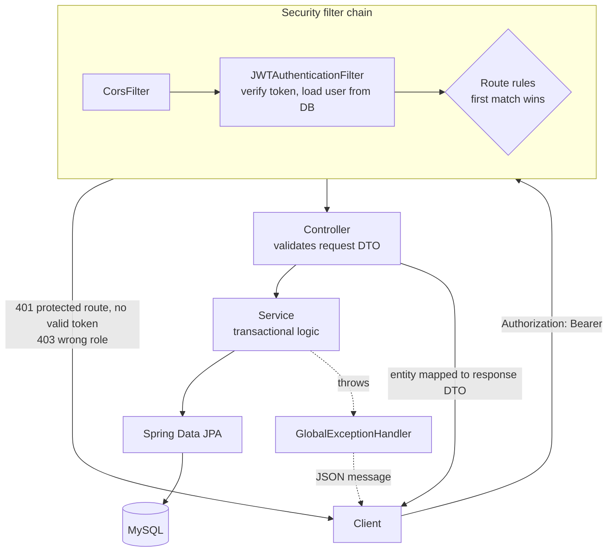
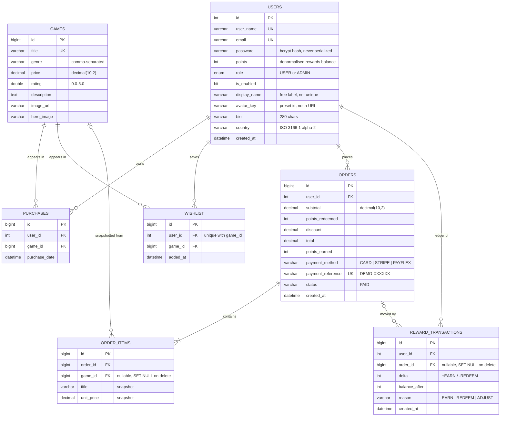

# gameStore-backend

A REST API for a game store, built with Spring Boot 3 and MySQL. It covers stateless JWT
authentication, role-based access control (`USER` / `ADMIN`), a paginated and searchable game
catalogue, admin user management, self-service profile editing, a wishlist, and a simulated checkout
with order receipts, a library, and a points ledger. Flyway owns the schema, and an H2-backed
integration suite covers the API.

[](https://openjdk.org/projects/jdk/17/)
[](https://spring.io/projects/spring-boot)
[](https://www.mysql.com/)
[](https://flywaydb.org/)
[](#testing)
[](LICENSE)

> **Live demo:** _coming soon_ · **Frontend:** [`Robotbino/gameStore`](https://github.com/Robotbino/gameStore) · **Docs:** [Handbook hub](docs/index.html) · [Architecture](docs/architecture.html) · [Learning guide](docs/architecture-and-learning-guide.html) · [Roadmap](docs/backend-roadmap.html)


<sub>The companion React app ([`Robotbino/gameStore`](https://github.com/Robotbino/gameStore)) running against this API. Every price, points balance, and `DEMO-` reference on that screen is computed here.</sub>

---

## Contents

- [At a glance](#at-a-glance)
- [Quick start](#quick-start)
- [Running with the frontend](#running-with-the-frontend)
- [Configuration](#configuration)
- [How a request flows](#how-a-request-flows)
- [API reference](#api-reference)
  - [Auth](#auth--apiv2auth) · [Games](#games--games) · [Users](#users--users) · [Wishlist](#wishlist--wishlist) · [Orders](#orders--orders) · [Rewards](#rewards--rewards) · [Purchases (legacy)](#purchases--purchases-legacy)
- [Error contract](#error-contract)
- [Data model](#data-model)
- [Database & migrations](#database--migrations)
- [Testing](#testing)
- [Project structure](#project-structure)
- [Tech stack](#tech-stack)
- [Known limitations](#known-limitations)
- [Troubleshooting](#troubleshooting)
- [Roadmap](#roadmap)
- [Documentation](#documentation)
- [License](#license)

---

## At a glance

| | |
|---|---|
| **Endpoints** | 26 routes across 7 controllers: auth, games, users, wishlist, orders, rewards, and legacy purchases |
| **Security** | Stateless JWT (HS256, 24 h), BCrypt passwords, role rules in one ordered filter chain, identity taken only from the token |
| **Persistence** | MySQL 8, 7 JPA entities, a schema owned by 6 Flyway migrations, and `ddl-auto=validate`, so drift fails startup |
| **Commerce** | One-transaction checkout with price snapshots, a `DEMO-` payment reference, and a points ledger (earn 10 pts per R1, redeem 100 pts = R1) |
| **Contract** | Request and response DTOs, a paged envelope the project owns, and a single JSON error shape `{"message": …}` |
| **Tests** | 63 integration tests against in-memory H2, so they need no MySQL and no secrets |

---

## Quick start

### Prerequisites

| Requirement | Notes |
|---|---|
| **JDK 17+** | Needs a full JDK, not a JRE: with a JRE, Maven fails with *"No compiler is provided in this environment"*. Lombok is on an explicit `annotationProcessorPaths` entry, so newer JDKs (23+) work too. |
| **MySQL 8** | Running locally on `3306`. You only have to create the empty database; Flyway builds every table. |
| **Maven** | Optional. The `mvnw` / `mvnw.cmd` wrapper is committed. |

### 1. Create the database

```sql
CREATE DATABASE gamestore_db;
```

Flyway runs `src/main/resources/db/migration/` at startup and builds the schema from
`V1__baseline.sql` onward.

### 2. Supply the two required secrets

`application.properties` reads them as placeholders with no committed defaults. The app will not
start without them.

**Option A: environment variables**

```bash
# bash / Git Bash / macOS / Linux
export DB_PASSWORD='your-mysql-password'
export JWT_SECRET="$(openssl rand -base64 32)"   # Base64, >= 256 bits for HS256
```

```powershell
# Windows PowerShell
$env:DB_PASSWORD = 'your-mysql-password'
$b = New-Object byte[] 32; [Security.Cryptography.RandomNumberGenerator]::Create().GetBytes($b)
$env:JWT_SECRET = [Convert]::ToBase64String($b)
```

In IntelliJ, set the same two under **Run → Edit Configurations → Environment variables** instead of
editing tracked files.

**Option B: the gitignored `local` profile**

```bash
cp src/main/resources/application-local.properties.example src/main/resources/application-local.properties
# fill in JWT_SECRET= and DB_PASSWORD= , then run with the local profile (step 3)
```

`application-local.properties` is gitignored. The `.example` template is committed so a fresh clone
knows what it needs. Recreate it on every new machine.

### 3. Run

```bash
./mvnw spring-boot:run                                        # Option A
./mvnw spring-boot:run -Dspring-boot.run.profiles=local       # Option B
```

```powershell
.\mvnw.cmd spring-boot:run -Dspring-boot.run.profiles=local   # Windows
```

The API starts on **http://localhost:8181**.

### 4. Accounts: one is seeded, the admin is not

| Account | How it comes to exist | Role |
|---|---|---|
| `user@gamestore.com` / `12345678` | Seeded on first boot by a `CommandLineRunner` in [`BinoApplication`](src/main/java/com/gameStore/Bino/BinoApplication.java). It is skipped if that email already exists. | `USER` |
| `admin@gamestore.com` | **Not seeded.** Register it yourself (below). Any account registered with the address in `admin.email` is created as `ADMIN`. The comparison ignores case, and the first person to register that address gets the role. | `ADMIN` |

```bash
curl -X POST http://localhost:8181/api/v2/auth/register \
  -H "Content-Type: application/json" \
  -d '{"userName":"admin","email":"admin@gamestore.com","password":"choose-a-strong-one"}'
```

> The startup log prints `ADMIN email=admin@gamestore.com password=12345678` on every boot. **That
> line is wrong.** It is hardcoded, no admin is created, and it does not know your admin's real
> password. Fixing it is roadmap **B3**. After the first admin exists, that admin can create more
> with `POST /users/add {"role":"ADMIN"}` or promote someone with `PUT /users/{id}`.

### 5. Add some games

A fresh database has **an empty catalogue**. The migrations build tables but seed no games. You can
add games through the frontend's admin portal (`/admin/games`) or directly:

```bash
ADMIN_TOKEN=$(curl -s -X POST http://localhost:8181/api/v2/auth/authenticate \
  -H "Content-Type: application/json" \
  -d '{"email":"admin@gamestore.com","password":"choose-a-strong-one"}' \
  | sed -E 's/.*"access_token":"([^"]+)".*/\1/')

curl -X POST http://localhost:8181/games/add \
  -H "Authorization: Bearer $ADMIN_TOKEN" -H "Content-Type: application/json" \
  -d '{"title":"Hades","genre":["Roguelike","Action","Indie"],"price":545.99,"rating":4.9,
       "description":"Defy the god of the dead as you hack and slash your way out of the Underworld.",
       "imageUrl":"https://cdn.cloudflare.steamstatic.com/steam/apps/1145360/library_600x900.jpg",
       "heroImage":"https://cdn.cloudflare.steamstatic.com/steam/apps/1145360/library_hero.jpg"}'
```

The artwork convention the catalogue uses is Steam's own CDN: `library_600x900.jpg` for the cover and
`library_hero.jpg` for the hero, keyed by Steam app id. `V2__dedupe_games_and_standardise_art.sql`
lists the app ids of the 30 titles the demo catalogue was built from.

### 6. Call something

```bash
# Log in as the seeded user and read your own record
TOKEN=$(curl -s -X POST http://localhost:8181/api/v2/auth/authenticate \
  -H "Content-Type: application/json" \
  -d '{"email":"user@gamestore.com","password":"12345678"}' \
  | sed -E 's/.*"access_token":"([^"]+)".*/\1/')

curl http://localhost:8181/users/me -H "Authorization: Bearer $TOKEN"
curl "http://localhost:8181/games/all?q=hades&size=5"      # public, no token needed
```

Register and login both respond `200 {"access_token": "<jwt>"}`. Passwords must be **at least 8
characters**. A shorter one returns `400` with a per-field `errors` map.

---

## Running with the frontend

The React client lives in [`Robotbino/gameStore`](https://github.com/Robotbino/gameStore). Clone the
two repos side by side. The docs cross-links assume that layout.

```
Projects/
├── gameStore/            # React 19 + Vite, dev server on :5173
└── gameStore-backend/    # this repo, API on :8181
```

1. Start this API as above.
2. In `gameStore/`, run `npm ci`, then `npm run dev`.
3. Open **http://localhost:5173** and sign in as `user@gamestore.com` / `12345678`, or as your admin.

CORS allows **exactly one origin**, `http://localhost:5173` ([`CorsConfig`](src/main/java/com/gameStore/Bino/configuration/CorsConfig.java)).
The frontend's Vite config sets `strictPort: true` for that reason. If 5173 is busy, Vite fails loudly
instead of moving to 5174, where every API call would fail CORS and look like a dead server.

---

## Configuration

Every key lives in [`src/main/resources/application.properties`](src/main/resources/application.properties).

### Read from the environment

| Variable | Required | Default | Purpose |
|---|---|---|---|
| `JWT_SECRET` | **yes** | — | Base64 HMAC key for HS256 signing. Generate with `openssl rand -base64 32`. Never reuse a value that has appeared in a repo or chat. |
| `DB_PASSWORD` | **yes** | — | MySQL password |
| `DB_USERNAME` | no | `root` | MySQL user |

These three are `${…}` placeholders. They resolve from real environment variables or from any
property source, including `application-local.properties`.

### Overridable through Spring's relaxed binding

Everything else is written as a literal. Spring Boot still lets a **real OS environment variable**
override any property by its upper-snake name. This works only from the environment, not from
`application-local.properties`:

| Property | Default | Override with |
|---|---|---|
| `server.port` | `8181` | `SERVER_PORT` |
| `spring.datasource.url` | `jdbc:mysql://localhost:3306/gamestore_db` | `SPRING_DATASOURCE_URL` |
| `admin.email` | `admin@gamestore.com` | `ADMIN_EMAIL` |
| `jwt.expiration` | `86400000` ms (24 h) | `JWT_EXPIRATION` |

The commented-out keys in `application-local.properties.example` (`DB_URL`, `SERVER_PORT`,
`ADMIN_EMAIL`, `CORS_ALLOWED_ORIGINS`, `RAWG_API_KEY`) are placeholders for planned work. Nothing reads
them from that file yet.

### Fixed in code

| Setting | Value | Where |
|---|---|---|
| CORS | Origin `http://localhost:5173`, methods `GET POST PUT DELETE OPTIONS`, all headers, credentials allowed, mapped on `/**` | [`CorsConfig.java`](src/main/java/com/gameStore/Bino/configuration/CorsConfig.java). Moving the origin to an env var is roadmap **B1**. |
| Page size | Default `20`, sorted by `id`, from `@PageableDefault` on the controllers. The ceiling is `100` (`spring.data.web.pageable.max-page-size`). | The ceiling stops a client defeating pagination with `?size=100000`. Larger values are silently clamped. |
| Hibernate DDL | `validate` | Flyway owns the schema. Hibernate only checks that the entities match it. |
| Logging | Verbose: `show-sql` plus `org.hibernate.SQL=DEBUG`, so every statement prints twice. DEBUG is also on for the app, Spring Security, transactions, and JDBC. | Useful while learning the request path, but noisy. Turn it down before any shared deployment (roadmap **B2**). |

---

## How a request flows



Things worth knowing about that chain:

- **Sessions are stateless.** Every request re-authenticates from the `Authorization: Bearer` header.
  Nothing is stored server-side, so a password change does not revoke tokens already issued.
- **Rule order in [`SecurityConfiguration`](src/main/java/com/gameStore/Bino/configuration/SecurityConfiguration.java) is load-bearing.**
  `GET /games/**` must come before the `/games/**` ADMIN rule, and `/users/me` + `/users/me/**` must come before
  `/users/**`. First match wins, so otherwise the broad rule would swallow the specific one and a
  logged-in `USER` could never read their own record.
- **Identity always comes from the token**, never from a body field or query param
  (`@AuthenticationPrincipal`). Reading a user id from `?userId=` would be a textbook IDOR.
- **Authorities are reloaded from the database on every request.** The JWT is HS256 with subject =
  the user's **email**, a `role` claim, and a 24-hour expiry. The server never reads that `role`
  claim, so a promotion or demotion takes effect on the next request. The claim exists for the
  frontend's UI gating.
- **A bad token on a public route is ignored, not rejected.** The filter lets the request continue
  anonymously, so `GET /games/all` still works with a stale token. A protected route then answers `401`.

| Path | Rule |
|---|---|
| `/api/v2/auth/**`, `/error` | public |
| `GET /games/**` | public |
| any other `/games/**` | `ADMIN` |
| `/users/me`, `/users/me/**` | authenticated |
| any other `/users/**` | `ADMIN` |
| `/orders/**`, `/rewards/**` | authenticated |
| everything else (`/wishlist/**`, `/purchases/**`, …) | authenticated |

---

## API reference

Base URL `http://localhost:8181`. All request bodies are JSON and validated with `@Valid` against
dedicated request DTOs. Entities are never bound directly to a request body.

### Auth — `/api/v2/auth`

| Method | Endpoint | Access | Description |
|---|---|---|---|
| POST | `/api/v2/auth/register` | Public | Create an account. Returns a JWT (`200`). |
| POST | `/api/v2/auth/authenticate` | Public | Log in with email + password. Returns a JWT (`200`). |

<details>
<summary><code>POST /api/v2/auth/register</code>: request, response, and rules</summary>

```json
// request
{ "userName": "bino", "email": "bino@example.com", "password": "secret12" }

// 200
{ "access_token": "eyJhbGciOiJIUzI1NiJ9..." }
```

- `userName` and `email` are required, `email` must be well-formed, and `password` must be ≥ 8 characters.
- A duplicate email returns `400 {"message": "Email already in use"}`.
- A duplicate **username** is not checked in code. It hits the database's unique key and currently
  comes back as `500` (see [Known limitations](#known-limitations)).
- The new account gets `ADMIN` if its email matches `admin.email` (case-insensitive), otherwise `USER`.
- `authenticate` requires both fields. A wrong password or unknown email is a deliberately vague
  `401 {"message": "Invalid email or password"}`.
</details>

### Games — `/games`

| Method | Endpoint | Access | Description |
|---|---|---|---|
| GET | `/games/all` | Public | Paginated catalogue with optional search and genre filters |
| GET | `/games/find/{id}` | Public | One game by id |
| POST | `/games/add` | ADMIN | Create a game (`201`) |
| PUT | `/games/{id}` | ADMIN | Update a game (`200`) |
| DELETE | `/games/{id}` | ADMIN | Delete a game (`204`). Fails for a game anyone owns; see [Known limitations](#known-limitations). |
| POST | `/games/sync/rawg` | ADMIN | **Placeholder.** Returns `501 {"message": "admin catalog sync — pending RAWG integration"}` |

The non-REST shapes (`/find/{id}`, `/add`) predate the project's conventions. The frontend mirrors
them rather than having either side rename them on its own.

**Query parameters on `/games/all`**: all optional, all combinable.

| Param | Default | Meaning |
|---|---|---|
| `q` | — | Case-insensitive substring match on **title only** (`LIKE %q%`) |
| `genre` | — | Equality against the **whole** stored genre string. See the note below. |
| `page` | `0` | Zero-based page index |
| `size` | `20` | Rows per page, clamped to `100` |
| `sort` | `id,asc` | `field,dir`, e.g. `?sort=price,desc`. An unknown field is currently a `500`. |

The default `id,asc` sort is deliberate. An unsorted paginated query returns rows in DB order, which
is stable within one request but not across requests, so paging from 2 to 3 could repeat or skip a row.

> **`genre` is exact-match against a comma-separated column.** A game stored as
> `"RPG, Open World, Fantasy"` is matched only by `?genre=RPG, Open World, Fantasy`, not by `?genre=RPG`.
> MySQL's `_ai_ci` collation makes that match case-insensitive; H2 in tests is case-sensitive.
> Splitting genres into their own table is the real fix.

<details>
<summary><code>GET /games/all?q=witch&size=2</code>: the paged envelope</summary>

```json
{
  "content": [
    {
      "id": 1,
      "title": "The Witcher 3",
      "genre": "RPG, Open World, Story Rich, Fantasy",
      "price": 899.99,
      "rating": 4.8,
      "description": "…",
      "imageUrl": "https://cdn.cloudflare.steamstatic.com/steam/apps/292030/library_600x900.jpg",
      "heroImage": "https://cdn.cloudflare.steamstatic.com/steam/apps/292030/library_hero.jpg"
    }
  ],
  "page": 0,
  "size": 2,
  "totalElements": 1,
  "totalPages": 1
}
```

Responses are wrapped in `PagedResponse<T>`, a small record this project owns, rather than Spring
Data's `Page<T>`. Spring Boot 3.3 explicitly warns that `PageImpl`'s JSON shape is not a stable contract.
</details>

<details>
<summary><code>GameRequest</code>: the create/update body and its validation</summary>

| Field | Rule |
|---|---|
| `title` | Required (`@NotBlank`). Unique in MySQL since V2; a duplicate is currently a `500`. |
| `genre` | Optional. Send either `"Action, RPG"` or `["Action","RPG"]`. `GenreDeserializer` trims array elements and joins them with `","`. |
| `price` | Required and `> 0`. Stored as `decimal(10,2)`. |
| `rating` | Optional, `0.0`–`5.0` (RAWG's scale) |
| `description` | Optional, `text` |
| `imageUrl`, `heroImage` | Optional, ≤ 500 chars in the DTO. The columns are `varchar(255)`, so a 256–500 char URL fails at the database. |
</details>

### Users — `/users`

| Method | Endpoint | Access | Description |
|---|---|---|---|
| GET | `/users/me` | Authenticated | The caller's own record, identified by the token |
| PUT | `/users/me` | Authenticated | Change your own `userName` only (`200`). The token stays valid because its subject is the email. |
| PUT | `/users/me/profile` | Authenticated | Edit your own display name, avatar, bio, and region (`200`) |
| PUT | `/users/me/account` | Authenticated | Edit your own username and email (`200`). Returns a fresh token. |
| PUT | `/users/me/password` | Authenticated | Change your own password; you must prove the current one (`204`) |
| GET | `/users/all` | ADMIN | Paginated user list. `?q=` is a case-insensitive username substring, plus `page`/`size`/`sort`. |
| POST | `/users/add` | ADMIN | Create a user (`201`) |
| PUT | `/users/{id}` | ADMIN | Update a user (`200`) |
| DELETE | `/users/{id}` | ADMIN | Delete a user (`204`). Their purchases, wishlist, orders, and ledger rows go with them. |

Every `/users` response is mapped to `UserResponse`, with fields `id`, `userName`, `email`, `role`,
`points`, `displayName`, `avatarKey`, `bio`, `country`, and `createdAt`.
**The password hash has no field in that record**, so it cannot leak by accident. An integration test
asserts it never appears in a response body.

<details>
<summary>Admin bodies: <code>POST /users/add</code> and <code>PUT /users/{id}</code></summary>

```json
// POST /users/add: userName, email, password (≥ 8) required. points defaults to 0, role to USER
{ "userName": "dave", "email": "dave@example.com", "password": "secret12", "points": 0, "role": "USER" }

// PUT /users/{id}: userName and email required; password, points, role optional
{ "userName": "dave", "email": "dave@example.com", "role": "ADMIN" }
```

On `PUT /users/{id}`, an omitted `password` keeps the stored hash, and `points` and `role` are only
overwritten when supplied, so a partial edit can't null them out. Duplicate email or username returns
`400` (`"Email already in use"` / `"Username already in use"`).
</details>

<details>
<summary>The self-service endpoints, and the two traps they exist to avoid</summary>

They are split three ways rather than folded into one endpoint, so each maps to exactly one form on
the settings page and a bug in one can't reach the others. The older `PUT /users/me` takes
`{"userName": …}` and remains as a username-only shortcut; `/account` supersedes it for anything that
touches the email. **None of them accepts `role`, `points`, or `enabled`.** A caller editing their own
record has no field that could promote them, just as `UserResponse` has no field for the password hash.

```json
// PUT /users/me/profile: every field REPLACES, including with null, so a bio can be cleared
{ "displayName": "Bino H", "avatarKey": "marquee-09", "bio": "Mostly RPGs.", "country": "ZA" }

// PUT /users/me/account → 200
{ "user": { "id": 14, "userName": "DemoUser", "…": "…" }, "access_token": "eyJhbGciOiJIUzI1NiJ9..." }

// PUT /users/me/password → 204 on success
{ "currentPassword": "…", "newPassword": "…" }
```

| Endpoint | Field rules |
|---|---|
| `/me/profile` | Nothing required. `displayName` ≤ 50, `avatarKey` ≤ 32 (a preset id, not a URL, and not allow-listed), `bio` ≤ 280, `country` empty or two letters (ISO 3166-1 alpha-2). Values are trimmed and blanks become `null`, so `{}` clears all four. |
| `/me/account` | `userName` required. `email` required and well-formed. Both must be unique among *other* users; the email check ignores case. |
| `/me/password` | `currentPassword` required. `newPassword` required and ≥ 8 characters. |

**Why `/account` hands back a token.** A JWT's subject is the user's *email*, and `JWTAuthenticationFilter`
looks the caller up with `findByEmail` on that subject. The moment someone changes their email, every
token they hold names an address that no longer exists. The filter finds nobody, the request arrives
unauthenticated, and the frontend's 401 interceptor sends them to the login page mid-save. The
response carries a new token so the client can swap it in and stay signed in.

**Why a wrong current password is `400`, not `401`.** 401 is the honest status and the wrong choice
here. The frontend treats any 401 outside `/auth/` as a dead session and clears the token, so a typo in
the "current password" box would log you out. `InvalidPasswordException` maps to 400 instead. The same
reasoning already made duplicates 400 rather than 409.

Note that the security chain matches `"/users/me"` **and** `"/users/me/**"`. The first pattern alone
matches only that exact path, so every sub-path would fall through to the `/users/**` ADMIN rule and
return 403 to the users it exists to serve. `ProfileEndpointsIT` asserts that a plain USER reaches all
three sub-paths.
</details>

### Wishlist — `/wishlist`

| Method | Endpoint | Access | Description |
|---|---|---|---|
| GET | `/wishlist/me` | Authenticated | The caller's wishlist, most recently added first (`200`) |
| POST | `/wishlist/{gameId}` | Authenticated | Save a game for later (`201`). Adding it twice returns the existing entry, still `201`. |
| DELETE | `/wishlist/{gameId}` | Authenticated | Remove a game (`204`). Removing a game that isn't on the list is also `204`. |

An unknown `gameId` returns `404` on both `POST` and `DELETE`. `/wishlist` has no rule of its own in
`SecurityConfiguration`; it falls through to `anyRequest().authenticated()`, and `WishlistService`
scopes the list to the token's subject.

<details>
<summary><code>GET /wishlist/me</code>: response</summary>

```json
// 200
[
  { "id": 3, "addedAt": "2026-09-20T09:12:44.118", "game": { "id": 1, "title": "The Witcher 3", "…": "…" } }
]
```

Each row is a `WishlistResponse(id, addedAt, game)`. The `wishlist` table (V4) has a unique key on
`(user_id, game_id)`, so a repeat `POST` cannot create a second row even if the service check were
bypassed. `WishlistIT` asserts that the second add leaves one entry.
</details>

### Orders — `/orders`

| Method | Endpoint | Access | Description |
|---|---|---|---|
| POST | `/orders/checkout` | Authenticated | Simulated checkout: creates an order, snapshots the lines, moves points, and grants ownership (`201`) |
| GET | `/orders/me` | Authenticated | The caller's receipts, newest first (`200`) |
| GET | `/orders/{id}` | Authenticated | One receipt, scoped to the caller, so someone else's id is `404` (`200`) |

**This is the checkout.** `POST /purchases` below is the older path from B9. It still works, but it
writes no order, moves no points, and is kept only so existing clients don't break.

<details>
<summary><code>POST /orders/checkout</code>: request, receipt, and the transaction step by step</summary>

```json
// request: the buyer is never in the body; it comes from the JWT
{ "gameIds": [11, 22, 16, 16], "paymentMethod": "CARD", "redeemPoints": true }

// 201
{
  "id": 1,
  "subtotal": 1219.97,
  "pointsRedeemed": 226,
  "discount": 2.26,
  "total": 1217.71,
  "pointsEarned": 12177,
  "pointsBalance": 12177,
  "paymentMethod": "CARD",
  "paymentReference": "DEMO-2U4AZS",
  "status": "PAID",
  "createdAt": "2026-09-23T19:36:02.551",
  "items": [
    { "gameId": 11, "title": "Elden Ring", "unitPrice": 899.99, "imageUrl": "https://…" },
    { "gameId": 22, "title": "Celeste",    "unitPrice": 219.99, "imageUrl": "https://…" },
    { "gameId": 16, "title": "Portal 2",   "unitPrice": 99.99,  "imageUrl": "https://…" }
  ],
  "alreadyOwned": []
}
```

`gameIds` must not be empty and `paymentMethod` must not be null (Bean Validation's default messages).
`paymentMethod` must be one of `CARD | STRIPE | PAYFLEX`; an unknown value is
`400 {"message": "Malformed request body"}`. `redeemPoints` defaults to `false`.

What happens inside the single transaction in `OrderService.checkout`:

1. Ids are de-duplicated, and each must exist (`404` otherwise). Games the caller already owns go into
   `alreadyOwned` and are left out of the totals. If nothing is left to pay for, the request fails with
   `400 {"message": "Nothing to pay for: you already own every game in this cart"}` and no points move.
2. `subtotal` is the sum of the payable prices. With `redeemPoints`, the discount is the Rand value of
   the whole balance, **capped at the subtotal** and rounded down to the cent. `total = subtotal − discount`.
3. An `orders` row is written with one `order_items` line per game. Each line **snapshots `title` and
   `unitPrice`** at that moment, so a later price edit never rewrites a receipt.
4. `paymentReference` is `DEMO-` plus six characters from `SecureRandom`, drawn from
   `ABCDEFGHJKLMNPQRSTUVWXYZ23456789` (no `0/O/1/I`). The column is `UNIQUE`. `status` is always
   `PAID`: there is no payment provider, and the server never declines.
5. A `REDEEM` and/or `EARN` row lands in `reward_transactions`, and `users.points` is updated (see Rewards).
6. A `purchases` row is written per game, so the library shows the same ownership whichever path
   bought the game.

`pointsBalance` on the checkout response is the balance **after** this order. On the two `GET`s it is
the caller's **current** balance, the same value on every row. `alreadyOwned` is always `[]` on the `GET`s.
`CheckoutIT` covers earning, redeeming, the cap, the zero-balance no-op, the all-owned `400`, owner
scoping on `GET /orders/{id}`, the unknown-game `404`, and the bad-enum `400`.
</details>

### Rewards — `/rewards`

| Method | Endpoint | Access | Description |
|---|---|---|---|
| GET | `/rewards/me` | Authenticated | Points balance, its Rand value, and the last 20 ledger rows (`200`) |

<details>
<summary><code>GET /rewards/me</code>: response and the two constants</summary>

```json
// 200
{
  "balance": 12177,
  "worth": 121.77,
  "transactions": [
    { "id": 2, "delta": 12177, "balanceAfter": 12177, "reason": "EARN",   "orderId": 1, "createdAt": "2026-09-23T19:36:02.560" },
    { "id": 1, "delta": -226,  "balanceAfter": 0,     "reason": "REDEEM", "orderId": 1, "createdAt": "2026-09-23T19:36:02.557" }
  ]
}
```

[`RewardsService`](src/main/java/com/gameStore/Bino/service/RewardsService.java) is the single source of
truth for the maths, in two constants:

| Constant | Value | Rule |
|---|---|---|
| `POINTS_PER_RAND_EARNED` | `10` | Earn 10 points per R1 of the order's **final** total (after any discount), rounded down |
| `POINTS_PER_RAND_OFF` | `100` | Redeem 100 points for R1 off at checkout, capped at the subtotal. `worth` is the balance at this rate. |

`reason` is `EARN` or `REDEEM`. (`ADJUST` exists in the enum but nothing writes it yet.) Rows are
ordered newest first. `users.points` is the denormalised balance, written in the same transaction as
every checkout's ledger rows, so `balanceAfter` serves as an audit trail. The one exception is an
admin setting `points` through `POST /users/add` or `PUT /users/{id}`, which writes the balance without
a ledger row. The frontend mirrors the two rules for previews, but the server always recomputes.
</details>

### Purchases — `/purchases` (legacy)

> **Legacy path.** These predate `/orders` (roadmap B9). `POST /purchases` grants ownership but writes
> no receipt and moves no points. New clients should call `POST /orders/checkout`, which writes the
> same `purchases` rows. `GET /purchases/me` is still the library read.

| Method | Endpoint | Access | Description |
|---|---|---|---|
| POST | `/purchases` | Authenticated | Buy one or more games for the caller, with no receipt or points (`201`) |
| GET | `/purchases/me` | Authenticated | The caller's library, most recent first (`200`) |

<details>
<summary><code>POST /purchases</code>: legacy checkout</summary>

```json
// request: the buyer is never in the body; it comes from the JWT
{ "gameIds": [1, 2, 2] }

// 201
{
  "purchased": [
    { "id": 10, "purchaseDate": "2026-08-08T14:03:11.482", "game": { "id": 1, "title": "…" } }
  ],
  "alreadyOwned": [2]
}
```

Ids are de-duplicated, and re-buying an owned game is **reported in `alreadyOwned`, not thrown**. Unlike
`/orders/checkout`, a cart you already fully own returns `201` with an empty `purchased` list, not `400`.
An unknown game id returns `404`. The response type is named `CheckoutResponse` for historical reasons;
`/orders/checkout` returns `OrderResponse`.
</details>

---

## Error contract

Errors are JSON shaped `{"message": "..."}`, produced by
[`GlobalExceptionHandler`](src/main/java/com/gameStore/Bino/exceptions/GlobalExceptionHandler.java).
The exceptions are `401` and `403`, which the security chain answers before any controller runs.

| Status | When | Body |
|---|---|---|
| `400` | Bean Validation failure | `{"message": "Validation failed", "errors": {"password": "password must be at least 8 characters"}}` |
| `400` | Duplicate email or username (admin and self-service paths), duplicate email on register | `{"message": "Email already in use"}` / `{"message": "Username already in use"}` |
| `400` | Wrong current password on `PUT /users/me/password` | `{"message": "Current password is incorrect"}`: `400`, not `401`, so the frontend doesn't treat a typo as a dead session |
| `400` | A cart with nothing left to pay for | `{"message": "Nothing to pay for: you already own every game in this cart"}` (`InvalidCheckoutException`) |
| `400` | A body Jackson can't bind (malformed JSON, unknown `paymentMethod`) | `{"message": "Malformed request body"}` |
| `401` | Missing, expired, or invalid token on a protected route | **empty body**. `HttpStatusEntryPoint` returns 401 (not 403) so the frontend can redirect to login. |
| `401` | Wrong password or unknown user at login | `{"message": "Invalid email or password"}`, deliberately vague so it can't be used to enumerate accounts |
| `403` | Valid token, insufficient role | Spring Boot's default error JSON: `{"timestamp", "status": 403, "error": "Forbidden", "path"}` |
| `404` | Missing record | `{"message": "Game not found with id: 42"}`. There are also `User …` and `Order …` variants. |
| `404` | No such route (authenticated caller) | `{"message": "No such endpoint"}`. An anonymous request to an unknown path gets `401` first, because the security chain runs before routing. |
| `500` | Anything else | `{"message": "An unexpected error occurred"}`. The real cause is logged, never returned. |

That `500` backstop replaced an earlier mapping of `RuntimeException` to `400`, which blamed the
client for genuine server bugs (an NPE surfaced as "Bad Request"). It currently catches too much,
though. Because the advice catches `Exception` and doesn't extend `ResponseEntityExceptionHandler`,
several client mistakes that Spring would answer with a 4xx come back as `500` instead:

- `405`: e.g. `GET /games/1`, which only has `PUT`/`DELETE`
- `415`: missing `Content-Type`
- path type mismatches: `/games/find/abc`, `/orders/abc`
- an unknown `?sort=` field
- database unique-key and foreign-key violations (see [Known limitations](#known-limitations))

Duplicates return `400` rather than the more textbook `409` because the frontend's error catalogue
keys on `400` for that case. This is documented in §8 of the [architecture doc](docs/architecture.html).

---

## Data model



Three tables share the user–game axis, and each means something different:

- `purchases` is **ownership**. The library reads it, and both checkout paths write it.
- `wishlist` is **intent**. A unique `(user_id, game_id)` means a game is saved at most once.
- `orders` is the **receipt**: totals, the chosen payment method, and a `DEMO-` reference. Each
  `order_items` line snapshots `title` and `unit_price` at the moment of purchase, so a later price
  change never rewrites history. That is also why `order_items.game_id` is nullable with
  `ON DELETE SET NULL`: the line is designed to outlive the catalogue row.

**Cascades.** Deleting a user removes their wishlist, orders, and ledger rows through `ON DELETE
CASCADE`, and their purchases through JPA's `CascadeType.ALL` on `Users.purchases`. Deleting an
order cascades to its items. `Games` has no such cascade, and `purchases.game_id` is a plain foreign
key, so a game that anyone owns can't be deleted.

**Points** are a **simulated rewards balance**, settled on 2026-09-20 and implemented in
[`RewardsService`](src/main/java/com/gameStore/Bino/service/RewardsService.java): earn 10 points per R1
of an order's **final** total, and redeem 100 points for R1 off at checkout. `reward_transactions` is
the ledger, and `users.points` is the balance written alongside it. The points have no cash value. The
whole economy is simulated, no payment provider exists or is planned, and every order is `PAID` the
instant it is placed.

**Entities stay behind DTOs.** `Users` implements Spring Security's `UserDetails`, and `getUsername()`
returns the **email**: authentication is by email, while `getUserName()` remains the display handle.
Both `Purchases` associations are `LAZY` and both back-references are `@JsonIgnore`, which is why
endpoints return response DTOs rather than entities. Serializing an entity directly would either fire
N+1 queries or throw `LazyInitializationException` outside a transaction. `PurchaseResponse` and
`WishlistResponse` still embed the `Games` entity itself. Its JSON happens to match `GameResponse`,
and it is the last place an entity reaches the wire.

**Accepted debt.** `users.id` is `int` while `games.id` is `bigint`. This comes from the pre-Flyway era
and is recorded in the V1 baseline rather than quietly fixed, since changing a referenced PK type
carries real risk for no user-visible benefit.

**Profile fields sit flat on `users`** (V6) rather than in a 1:1 `user_profiles` table. At four
columns, the split would buy a join and a lifecycle question (create the row at registration, or
lazily on first save?) for no relationship information. `display_name` and `user_name` are both names
on purpose. `user_name` carries the `UNIQUE` key and is the handle; `display_name` is a free label, so
renaming yourself can never collide with somebody else. The UI prefers the label and falls back to the handle.

---

## Database & migrations

Flyway owns the schema. Migrations live in `src/main/resources/db/migration/` and run at startup.

| Migration | What it does |
|---|---|
| `V1__baseline.sql` | The schema exactly as `ddl-auto=update` left it, quirks preserved, so `validate` passes unchanged |
| `V2__dedupe_games_and_standardise_art.sql` | Removes duplicate catalogue rows and repoints their purchases at the surviving row. Drops duplicate `(user, game)` purchases, folds `NARAKA:BLADEPOINT` into `NARAKA: BLADEPOINT`, standardises artwork on Steam's CDN, and adds `UNIQUE(title)` |
| `V3__games_price_precision.sql` | Narrows `games.price` from Hibernate's default `decimal(38,2)` to `decimal(10,2)` |
| `V4__wishlist.sql` | Creates `wishlist` with a unique `(user_id, game_id)` key. Rows cascade away with their user or game. |
| `V5__orders_rewards.sql` | Creates `orders`, `order_items` (title/price snapshots, `game_id` `SET NULL` on delete), and `reward_transactions` (the points ledger). Adds cascades from users and orders, and backfills `users.points` from `NULL` to `0` so arithmetic starts at zero. |
| `V6__user_profile_fields.sql` | Adds `display_name`, `avatar_key`, `bio`, `country`, and `created_at` to `users`, backfilling `created_at` from each account's first purchase |

**Seeding.** No migration inserts games or users. V2's `INSERT`s only fill temporary lookup tables.
The only seed is the demo `USER` created by `BinoApplication` at startup.

**Baselines.** `spring.flyway.baseline-on-migrate=true` stamps a pre-existing database at V1 without
re-running the baseline against it. A fresh, empty schema **does** run V1 and builds the tables from
zero. Because `ddl-auto` is `validate`, any entity that drifts from the migrated schema fails startup
loudly instead of silently altering the database. That is why `@Column(precision = 10, scale = 2)`
landed on `Games.price` in the same commit as V3.

**Adding a migration.** The next file is `V7__<description>.sql`. Never edit a migration that has
already run anywhere, because Flyway checksums them. Two files with the same version number stop the
app from booting; this has happened here once already (fixed in commit `86eb050`).

---

## Testing

```bash
./mvnw test      # Surefire: BinoApplicationTests (context load) only
./mvnw verify    # + Failsafe: every *IT integration suite
./mvnw verify -Dit.test=CheckoutIT    # one suite
```

There are no pure unit tests yet (roadmap **B14**). `BinoApplicationTests` just boots the context.
The real coverage is **63 integration tests** in 7 `*IT` suites. They drive the API over MockMvc
against an in-memory **H2** database configured in `src/test/resources/application.properties`, so
the suite needs no MySQL and no real secrets, and can never touch your dev data.

Flyway is disabled under test. `V1__baseline.sql` is MySQL-specific (`bit(1)`, `ENGINE=InnoDB`) and
would fail, or worse, half-succeed, against H2. So Hibernate rebuilds the schema per run with
`create-drop`. The trade-off is that **database-only constraints are not exercised by the suite**:
the unique `title`, the `varchar(255)` URL columns, and the `ON DELETE` rules all live in the migrations,
not in the entities.

| Suite | Tests | Covers |
|---|---:|---|
| [`AuthFlowIT`](src/test/java/com/gameStore/Bino/AuthFlowIT.java) | 6 | Register, duplicate email, field-level validation errors, blank login fields, login success, and the vague-message 401 on a wrong password |
| [`GamesEndpointsIT`](src/test/java/com/gameStore/Bino/GamesEndpointsIT.java) | 10 | Anonymous reads and the paged envelope, `?q=` and `?genre=` filtering, page/size, ADMIN-vs-USER `403`, validation bounds, and both `genre` input shapes |
| [`UsersEndpointsIT`](src/test/java/com/gameStore/Bino/UsersEndpointsIT.java) | 7 | The RBAC ladder (`401` anonymous → `403` user → `200` admin), `/users/me` for users and admins, the profile contract on a new account, and no password in `/users/all` |
| [`SelfServiceUserIT`](src/test/java/com/gameStore/Bino/SelfServiceUserIT.java) | 8 | `PUT /users/me` (rename, taken name, blank name, anonymous) and `PUT /users/me/password` (new password works and the old one stops, wrong current → `400` not a logout, too short, anonymous) |
| [`ProfileEndpointsIT`](src/test/java/com/gameStore/Bino/ProfileEndpointsIT.java) | 16 | The three `/users/me/**` endpoints: a plain USER can reach them, nulls clear fields, bio length, no self-promotion, uniqueness that ignores your own row, the replacement token on an email change, malformed email, and `400`-not-`401` on a wrong current password |
| [`WishlistIT`](src/test/java/com/gameStore/Bino/WishlistIT.java) | 6 | Anonymous `401`, add then list, a second add keeping one entry, unknown game `404`, remove then list empty with a repeat `DELETE` still `204`, and scoping to the caller |
| [`CheckoutIT`](src/test/java/com/gameStore/Bino/CheckoutIT.java) | 10 | `401` on orders and rewards, snapshots and points earned, redemption, the cap at the subtotal, the zero-balance no-op, `alreadyOwned` excluded from totals, the all-owned `400` moving no points, owner scoping, unknown game `404`, bad `paymentMethod` `400` |

Not yet covered: `GET /games/find`, `PUT`/`DELETE /games/{id}`, `/games/sync/rawg`, the 100-row page
cap, the admin user endpoints beyond `/users/all`, and the legacy `/purchases` routes.

---

## Project structure

```
src/main/java/com/gameStore/Bino/
├── BinoApplication.java  # Entry point + the demo-USER seeder (CommandLineRunner)
├── authentication/       # RegisterRequest, AuthenticationRequest, AuthenticationResponse
├── configuration/        # SecurityConfiguration (route rules), JWTAuthenticationFilter, CorsConfig, ApplicationConfig (beans)
├── controllers/          # AuthenticationController, GamesControllers, UsersController, WishlistController,
│                         #   OrderController, RewardsController, PurchaseController
├── dto/                  # Request/response records: GameRequest/GameResponse, CreateUserRequest,
│                         #   UpdateUserRequest, UserResponse, PagedResponse, UpdateProfileRequest,
│                         #   UpdateProfileDetailsRequest, UpdateAccountRequest, AccountUpdateResponse,
│                         #   ChangePasswordRequest, WishlistResponse, CheckoutRequest, OrderResponse,
│                         #   OrderItemResponse, RewardsSummaryResponse, RewardTransactionResponse,
│                         #   PurchaseRequest, PurchaseResponse, CheckoutResponse (legacy /purchases)
├── exceptions/           # GlobalExceptionHandler + ResourceNotFound, DuplicateResource, EmailAlreadyExists,
│                         #   InvalidPassword, InvalidCheckout
├── models/               # Entities: Users, Games, Purchases, Wishlists, Orders, OrderItems, RewardTransactions
│                         #   Enums: Role, PaymentMethod, OrderStatus, RewardReason · GenreDeserializer
├── repositories/         # 6 Spring Data JPA repositories (order items are saved through Orders' cascade)
└── service/              # AuthenticationService, JwtService, GamesService, UsersService, WishlistService,
                          #   OrderService, RewardsService, PurchaseService

src/main/resources/
├── application.properties                    # All config; secrets read from the environment
├── application-local.properties.example      # Committed template for the gitignored local profile
└── db/migration/                             # Flyway migrations V1 → V6

src/test/
├── java/com/gameStore/Bino/                  # AbstractIntegrationTest + 7 *IT suites + BinoApplicationTests
└── resources/application.properties           # H2, Flyway off, a throwaway JWT secret

docs/                                         # The interactive engineering handbook (see Documentation)
```

Layering is conventional and enforced by habit rather than tooling. Controllers map DTOs and
delegate. Services hold the transactional logic and own every business rule. Repositories touch
the database.

---

## Tech stack

| Layer | Choice |
|---|---|
| Language | Java 17 |
| Framework | Spring Boot 3.3.4: Web, Data JPA, Security, Validation |
| Persistence | MySQL 8 (Connector/J) + Hibernate 6. Flyway (`flyway-core` + `flyway-mysql`) owns the schema, with `ddl-auto=validate`. |
| Auth | JWT (jjwt 0.11.5, HS256), stateless, BCrypt-hashed passwords |
| Boilerplate | Lombok 1.18.34. Pinned, because 1.18.40+ trips an NPE in Spring Data Commons 3.3's entity introspection. |
| Build | Maven wrapper, with Surefire (unit) and Failsafe (`*IT`) |
| Test | JUnit 5, Spring Boot Test + MockMvc, Spring Security Test, H2 |

---

## Known limitations

These are stated plainly rather than hidden. Most already have a roadmap card.

- **No catalogue seed.** A fresh clone boots with zero games; add them as shown in [Quick start](#5-add-some-games).
- **Admin is bootstrapped by registration**, and the startup log advertises an admin password that
  doesn't exist (**B3**).
- **The demo user and its password are hardcoded** and seeded in every profile. Remove or change
  them before any shared deployment.
- **Some client errors surface as `500`**: wrong HTTP method, missing `Content-Type`, non-numeric path
  ids, an unknown `?sort=` field, a duplicate username on register, and a duplicate game title. The
  backstop in `GlobalExceptionHandler` catches Spring MVC's own 4xx exceptions and database constraint
  violations.
- **Games that anyone owns can't be deleted.** `DELETE /games/{id}` fails with `500` because of the
  `purchases.game_id` foreign key. For the same reason, the `order_items.game_id → NULL` path is only
  reachable with manual SQL today.
- **Genre filtering matches the whole comma-separated string**, so single-genre filters rarely match.
- **Admin edits to `points` bypass the ledger.** No `ADJUST` row is written.
- **`/users/me/account` re-issues a token without the `role` claim.** The server doesn't care, but the
  frontend reads the claim, so an **admin** who changes their email sees the store as a `USER` until
  they sign in again.
- **No token revocation, refresh, or rate limiting.** Tokens live their full 24 h (**B18**, **B19**).
- **CORS is hardcoded** to `http://localhost:5173` (**B1**), and logging is at development verbosity (**B2**).
- **H2 can't catch MySQL-only constraints**, as described under [Testing](#testing).

---

## Troubleshooting

| Symptom | Cause and fix |
|---|---|
| `No compiler is provided in this environment. Perhaps you are running on a JRE rather than a JDK?` | `JAVA_HOME` points at a JRE. Point it at a JDK 17+ install. |
| `Could not resolve placeholder 'JWT_SECRET'` (or `DB_PASSWORD`) | The secret isn't set. Export it, or run with `-Dspring-boot.run.profiles=local` and a filled-in `application-local.properties`. |
| `Access denied for user 'root'@'localhost'` | Wrong `DB_PASSWORD`, or your MySQL user isn't `root`. Set `DB_USERNAME`. |
| `Unknown database 'gamestore_db'` | Run `CREATE DATABASE gamestore_db;` first. |
| `Found more than one migration with version N` | Two files in `db/migration/` share a version. Renumber the newer one. |
| `Schema-validation: wrong column type …` / `missing column …` | An entity changed without a migration. Add a `V7__…sql` that makes the schema match. |
| `Port 8181 was already in use` | Another instance is running. Stop it, or set `SERVER_PORT`. |
| Frontend shows every request failing, and the browser console mentions CORS | The frontend isn't on exactly `http://localhost:5173`. |
| Every protected call returns `401` right after changing your email | The client didn't swap in the `access_token` returned by `PUT /users/me/account`. |
| The store is empty | Expected on a fresh database. See [Add some games](#5-add-some-games). |

---

## Roadmap

Tracked in full, with rationale and verdicts, in [`docs/backend-roadmap.html`](docs/backend-roadmap.html).

**Done**

- [x] Role-based restrictions on games and users endpoints (ADMIN-only management)
- [x] Self-service `GET /users/me` returning a `UserResponse` DTO
- [x] Proper error responses (JSON `{"message": …}` with correct status codes)
- [x] Bean Validation on request payloads (`@Valid` DTOs, field-level `errors` on 400)
- [x] H2 integration tests for auth, RBAC, the DTO contract, and validation
- [x] **B7**: Flyway wired up, `ddl-auto` moved to `validate`
- [x] **B8**: `games.price` narrowed to `decimal(10,2)`
- [x] **B9**: Purchase and library endpoints
- [x] **B10**: Server-side search, sort, and pagination
- [x] **B11**: `GameResponse` DTO
- [x] **B17**: Cart, checkout, and order snapshots: `POST /orders/checkout`, `orders` + `order_items`, `DEMO-` references (2026-09-20)
- [x] **BX1**: Wishlist endpoints, V4
- [x] **BX2**: Rewards ledger and redemption: `reward_transactions`, `GET /rewards/me`, 10 pts per R1 earned, 100 pts = R1 off
- [x] **BX3**: Self-service profile, account, and password endpoints, V6
- [x] **BX4**: `404 {"message": "No such endpoint"}` for unmapped routes instead of a generic `500`

The four **BX** cards were built on 2026-09-20 alongside B17, outside the planned order, and were
added to the board afterwards.

**Next**

- [ ] **B1**: Read the CORS origin from an env var
- [ ] **B2**: Add a production Spring profile
- [ ] **B3**: Fix the startup log that lies about the admin account
- [ ] **B4/B5**: Dockerise, then deploy to an Oracle Cloud Always-Free ARM VM
- [ ] **B6**: Publish the backend briefs to GitHub Pages
- [ ] **B12**: Actuator, exposing only `/health`
- [ ] **B13**: CI on every push (`mvnw verify`)
- [ ] **B14**: Unit tests for the pure logic (`RewardsService`'s two rules are the obvious first target)
- [ ] **B15**: Document `POST /games/sync/rawg` in the architecture briefs (this README already covers it)
- [ ] **B16**: RAWG catalogue with a tiered read-through cache
- [ ] **B18**: Rate-limit the auth endpoints
- [ ] **B19**: Refresh-token rotation

---

## Documentation

An interactive engineering handbook ships in `docs/`. Open the HTML files in any browser; there is no
build step, and they work offline from disk.

| Doc | What it covers |
|---|---|
| [`docs/index.html`](docs/index.html) | The front door: all six documents across both repos, with search |
| [`docs/architecture.html`](docs/architecture.html) | Backend architecture, request lifecycle, security, and the error contract (§8), plus the caching strategy, persistence plan, $0 deployment, Docker topology, and hardening (§11–§15) |
| [`docs/architecture-and-learning-guide.html`](docs/architecture-and-learning-guide.html) | Design patterns, Spring internals, and an OCA-badged Java tour with quizzes |
| [`docs/backend-roadmap.html`](docs/backend-roadmap.html) | Every roadmap item with its rationale, verdict, and maturity ladder |
| [Frontend docs](https://github.com/Robotbino/gameStore/tree/main/docs) | The companion React app's architecture, catalogue pivot, and roadmap |

The two repos' docs cross-link through a switcher strip at the top of each page. Those links assume
both repos are cloned side by side.

**Editing the docs.** Shared CSS and JS live once in `docs/_src/` and are stamped into each HTML file
between `<!-- GS:… -->` markers:

```bash
node docs/_src/stamp.mjs be-arch    # re-stamp one document by id (see docs.manifest.mjs)
node docs/_src/stamp.mjs            # re-stamp all eight targets across both repos
node docs/_src/stamp.mjs --check    # CI-style drift check, writes nothing
node docs/_src/build-index.mjs      # rebuild the ⌘K search index, then stamp again
```

See [`docs/_src/README.md`](docs/_src/README.md) for the full workflow.

---

## License

[MIT](LICENSE) © Bino Hlongwana
