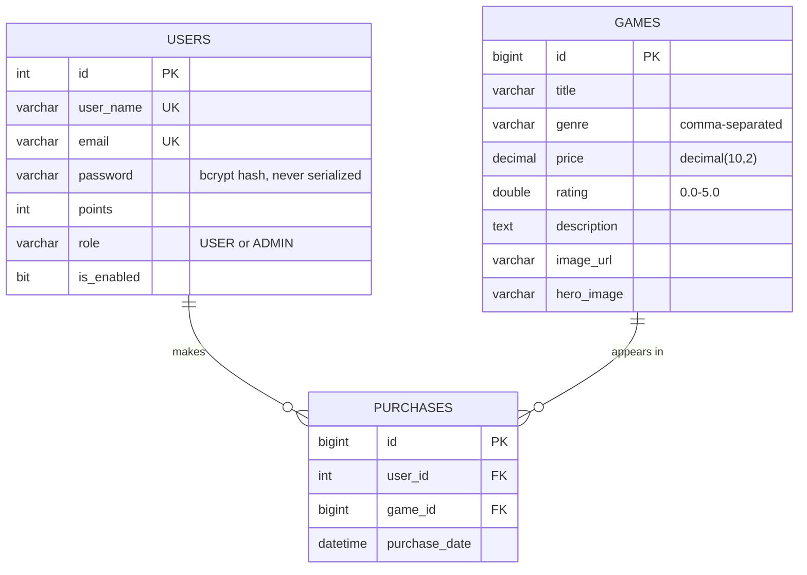

# gameStore-backend

A REST API for a game store, built with Spring Boot 3 and MySQL. It covers stateless JWT
authentication, role-based access control (`USER` / `ADMIN`), a paginated and searchable game
catalogue, admin user management, and a purchase-and-library flow — with a Flyway-owned schema
and an H2-backed integration suite.

[](https://openjdk.org/projects/jdk/17/)
[](https://spring.io/projects/spring-boot)
[](https://www.mysql.com/)
[](https://flywaydb.org/)
[](LICENSE)

> **Live demo:** _coming soon_ · **Frontend:** [`Robotbino/gameStore`](https://github.com/Robotbino/gameStore) · **Docs:** [Architecture](docs/architecture.html) · [Learning guide](docs/architecture-and-learning-guide.html) · [Roadmap](docs/backend-roadmap.html)

---

## Contents

- [Quick start](#quick-start)
- [Configuration](#configuration)
- [How a request flows](#how-a-request-flows)
- [API reference](#api-reference)
  - [Auth](#auth--apiv2auth)
  - [Games](#games--games)
  - [Users](#users--users)
  - [Purchases](#purchases--purchases)
- [Error contract](#error-contract)
- [Data model](#data-model)
- [Database & migrations](#database--migrations)
- [Testing](#testing)
- [Project structure](#project-structure)
- [Tech stack](#tech-stack)
- [Roadmap](#roadmap)
- [Documentation](#documentation)
- [License](#license)

---

## Quick start

### Prerequisites

| Requirement | Notes |
|---|---|
| **JDK 17** | The build targets Java 17. Newer JDKs need Lombok on an explicit `annotationProcessorPaths` entry — already configured in [`pom.xml`](pom.xml), along with a pinned Lombok `1.18.34` that avoids a Spring Data Commons 3.3 introspection crash. |
| **MySQL 8** running locally | Only the empty database has to exist; Flyway builds every table. |
| **Maven** | Optional — the `mvnw` wrapper is committed. |

### 1. Create the database

```sql
CREATE DATABASE gamestore_db;
```

That is the whole manual DB step. Flyway runs `src/main/resources/db/migration/` at startup and
creates the schema from `V1__baseline.sql` onward.

### 2. Supply the two required secrets

`application.properties` reads them as placeholders — there are no committed defaults, and the app
will not start without them:

```bash
export DB_PASSWORD='your-mysql-password'
export JWT_SECRET="$(openssl rand -base64 32)"   # Base64, >= 256 bits for HS256
```

In IntelliJ, set the same two as **environment variables** on the Run Configuration
(Run → Edit Configurations → Environment variables) rather than editing tracked files.

Alternatively, copy the committed template and activate the `local` profile:

```bash
cp src/main/resources/application-local.properties.example src/main/resources/application-local.properties
./mvnw spring-boot:run -Dspring-boot.run.profiles=local
```

`application-local.properties` is gitignored; the `.example` template is committed so a fresh clone
knows what it needs.

### 3. Run

```bash
./mvnw spring-boot:run
```

The API starts on **http://localhost:8181**.

### 4. Register, log in, call something

```bash
# Register — returns a JWT (200)
curl -X POST http://localhost:8181/api/v2/auth/register \
  -H "Content-Type: application/json" \
  -d '{"userName":"bino","email":"bino@example.com","password":"secret12"}'

# Log in — returns a JWT (200)
curl -X POST http://localhost:8181/api/v2/auth/authenticate \
  -H "Content-Type: application/json" \
  -d '{"email":"bino@example.com","password":"secret12"}'
```

Both respond with `{"access_token": "<jwt>"}`. Send it on protected routes:

```bash
curl http://localhost:8181/users/me -H "Authorization: Bearer <jwt>"
```

> Passwords must be **at least 8 characters** (Bean Validation), so a 6-character password returns
> `400` with a per-field `errors` map.

---

## Configuration

Every key lives in [`src/main/resources/application.properties`](src/main/resources/application.properties).
Only three values read from the environment today:

| Environment variable | Required | Default | Purpose |
|---|---|---|---|
| `JWT_SECRET` | **yes** | — | Base64 HMAC key for HS256 signing. Generate with `openssl rand -base64 32`; never reuse a value that has appeared in a repo or chat. |
| `DB_PASSWORD` | **yes** | — | MySQL password. |
| `DB_USERNAME` | no | `root` | MySQL user. |

Settings that are currently **hardcoded**, not environment-driven:

| Setting | Value | Where |
|---|---|---|
| Server port | `8181` | `application.properties` |
| Datasource URL | `jdbc:mysql://localhost:3306/gamestore_db` | `application.properties` |
| Admin email | `admin@gamestore.com` | `application.properties` — the account registered with this email is promoted to `ADMIN`; everyone else gets `USER` |
| JWT lifetime | `86400000` ms (24 h) | `application.properties` |
| CORS origin | `http://localhost:5173` (Vite dev server), credentials allowed | [`CorsConfig.java`](src/main/java/com/gameStore/Bino/configuration/CorsConfig.java) |
| Page size | default `20`, hard ceiling `100` | `application.properties` — the ceiling stops a client defeating pagination with `?size=100000` |
| Hibernate DDL | `validate` | Flyway owns the schema; Hibernate only checks that the entities match it, so drift fails startup instead of silently altering the database |

The commented-out entries in `application-local.properties.example` (`DB_URL`, `SERVER_PORT`,
`ADMIN_EMAIL`, `CORS_ALLOWED_ORIGINS`, `RAWG_API_KEY`) are placeholders for planned work — the
properties do not read them yet. Moving the CORS origin to an env var is roadmap **B1**.

---

## How a request flows

```mermaid
flowchart LR
    C[Client] --> CF[CorsFilter]
    CF --> JF[JWTAuthenticationFilter]
    JF -->|Bearer token| JS[JwtService<br/>verify + extract subject]
    JS --> UD[userDetailsService<br/>findByEmail]
    UD --> SC[SecurityContext]
    JF --> FC{"SecurityFilterChain<br/>rules — first match wins"}
    SC --> FC
    FC -->|401 no/bad token| C
    FC -->|403 wrong role| C
    FC --> CTRL[Controller<br/>@Valid request DTO]
    CTRL --> SVC[Service<br/>@Transactional]
    SVC --> REPO[Spring Data JPA]
    REPO --> DB[(MySQL)]
    CTRL -->|entity to response DTO| C
    SVC -.throws.-> GEH[GlobalExceptionHandler]
    GEH -.JSON message.-> C
```

Three things worth knowing about that chain:

- **Sessions are stateless.** Every request re-authenticates from the `Authorization: Bearer` header;
  nothing is stored server-side.
- **Rule order in [`SecurityConfiguration`](src/main/java/com/gameStore/Bino/configuration/SecurityConfiguration.java) is load-bearing.**
  `GET /games/**` must precede the `/games/**` ADMIN rule, and `/users/me` must precede `/users/**`
  — first match wins, so the broad rule would otherwise swallow the specific one and a logged-in
  `USER` could never read their own record.
- **Identity always comes from the token**, never from a body field or query param
  (`@AuthenticationPrincipal`). Reading a user id from `?userId=` would be a textbook IDOR.

The JWT is HS256, subject = the user's **email**, with a custom `role` claim and a 24-hour expiry.

---

## API reference

Base URL `http://localhost:8181`. All request bodies are JSON and validated with `@Valid` against
dedicated request DTOs — entities are never bound directly to a request body.

### Auth — `/api/v2/auth`

| Method | Endpoint | Access | Description |
|---|---|---|---|
| POST | `/api/v2/auth/register` | Public | Create an account, returns a JWT (`200`) |
| POST | `/api/v2/auth/authenticate` | Public | Log in with email + password, returns a JWT (`200`) |

<details>
<summary><code>POST /api/v2/auth/register</code> — request and response</summary>

```json
// request
{ "userName": "bino", "email": "bino@example.com", "password": "secret12" }

// 200
{ "access_token": "eyJhbGciOiJIUzI1NiJ9..." }
```

`userName` and `email` are required, `email` must be well-formed, `password` must be ≥ 8 characters.
A duplicate email returns `400 {"message": "Email already in use"}`.
</details>

### Games — `/games`

| Method | Endpoint | Access | Description |
|---|---|---|---|
| GET | `/games/all` | Public | Paginated catalogue with optional search and genre filters |
| GET | `/games/find/{id}` | Public | One game by id |
| POST | `/games/add` | ADMIN | Create a game (`201`) |
| PUT | `/games/{id}` | ADMIN | Update a game (`200`) |
| DELETE | `/games/{id}` | ADMIN | Delete a game (`204`) |
| POST | `/games/sync/rawg` | ADMIN | **Placeholder** — returns `501 Not Implemented` pending RAWG ingestion |

**Query parameters on `/games/all`** — all optional, all combinable:

| Param | Default | Meaning |
|---|---|---|
| `q` | — | Case-insensitive substring match on title |
| `genre` | — | Exact genre match |
| `page` | `0` | Zero-based page index |
| `size` | `20` | Rows per page, clamped to `100` |
| `sort` | `id,asc` | `field,dir` — e.g. `?sort=price,desc` |

The default `id,asc` sort is deliberate: an unsorted paginated query returns rows in DB order, which
is stable within one request but not across them, so paging 2 → 3 could repeat or skip a row.

<details>
<summary><code>GET /games/all?q=witch&size=2</code> — paged envelope</summary>

```json
{
  "content": [
    {
      "id": 1,
      "title": "The Witcher 3",
      "genre": "Action,RPG",
      "price": 29.99,
      "rating": 4.9,
      "description": "…",
      "imageUrl": "https://…",
      "heroImage": "https://…"
    }
  ],
  "page": 0,
  "size": 2,
  "totalElements": 1,
  "totalPages": 1
}
```

Responses are wrapped in `PagedResponse<T>` — a small record this project owns — rather than Spring
Data's `Page<T>`, because Spring Boot 3.3 explicitly warns that `PageImpl`'s JSON shape is not a
stable contract.
</details>

> **`genre` accepts both shapes.** It is stored as a comma-separated string, but a create/update may
> send either `"Action,RPG"` or `["Action","RPG"]` — `GenreDeserializer` normalises the array form.
> `price` must be positive and fits `decimal(10,2)`; `rating` is bounded `0.0–5.0` to match RAWG's scale.

### Users — `/users`

| Method | Endpoint | Access | Description |
|---|---|---|---|
| GET | `/users/me` | Authenticated | The caller's own record, identified by the token |
| GET | `/users/all` | ADMIN | Paginated user list (`?q=` filters by username, plus `page`/`size`/`sort`) |
| POST | `/users/add` | ADMIN | Create a user (`201`) |
| PUT | `/users/{id}` | ADMIN | Update a user (`200`) |
| DELETE | `/users/{id}` | ADMIN | Delete a user (`204`) |

Every `/users` response is mapped to `UserResponse` — `id`, `userName`, `email`, `role`, `points`.
**The password hash has no field in that record**, so it cannot leak by accident; an integration test
asserts it never appears in a response body.

On `PUT /users/{id}`, `password` is optional: omit it and the stored hash is kept. `points` and `role`
are likewise only overwritten when supplied, so a partial edit can't null them out.

### Purchases — `/purchases`

| Method | Endpoint | Access | Description |
|---|---|---|---|
| POST | `/purchases` | Authenticated | Buy one or more games for the caller (`201`) |
| GET | `/purchases/me` | Authenticated | The caller's library, most recent first (`200`) |

<details>
<summary><code>POST /purchases</code> — checkout</summary>

```json
// request — the buyer is never in the body; it comes from the JWT
{ "gameIds": [1, 2, 2] }

// 201
{
  "purchased": [
    { "id": 10, "purchaseDate": "2026-08-08T14:03:11.482", "game": { "id": 1, "title": "…" } }
  ],
  "alreadyOwned": [2]
}
```

The cart posts its whole contents in **one** request, so one checkout is one transaction rather than
N sequential calls that could half-fail. Ids are de-duplicated, and re-buying an owned game is
**reported in `alreadyOwned`, not thrown** — so the full login → cart → checkout → library flow can be
run twice (a rehearsal, then a live demo) without the second run erroring out. An unknown game id
returns `404`.
</details>

---

## Error contract

Every error is JSON shaped `{"message": "..."}`, produced by
[`GlobalExceptionHandler`](src/main/java/com/gameStore/Bino/exceptions/GlobalExceptionHandler.java).

| Status | When | Body |
|---|---|---|
| `400` | Bean Validation failure | `{"message": "Validation failed", "errors": {"password": "password must be at least 8 characters"}}` |
| `400` | Duplicate email or username | `{"message": "Email already in use"}` |
| `401` | Missing, expired, or invalid token | empty body — `HttpStatusEntryPoint` returns 401 (not 403) so the frontend can redirect to login |
| `401` | Wrong password or unknown user | `{"message": "Invalid email or password"}` — deliberately vague, so it can't be used to enumerate accounts |
| `403` | Valid token, insufficient role | Spring Security default |
| `404` | Missing record | `{"message": "Game not found with id: 42"}` |
| `500` | Anything unmapped | `{"message": "An unexpected error occurred"}` — the real cause is logged, never returned |

That `500` backstop matters: an earlier version mapped `RuntimeException` to `400`, which blamed the
client for genuine server bugs (an NPE surfaced as "Bad Request").

Duplicates return `400` rather than the more textbook `409` because the frontend's error catalogue
keys on `400` for that case — documented in §8 of the architecture doc.

---

## Data model



`Users` implements Spring Security's `UserDetails`, and `getUsername()` returns the **email** —
authentication is by email, while `getUserName()` remains the display name. Both `Purchases`
associations are `LAZY` and both back-references are `@JsonIgnore`, which is why every endpoint
returns a response DTO rather than an entity: serializing one directly would either fire N+1 queries
or throw `LazyInitializationException` outside a transaction.

`users.id` is `int` while `games.id` is `bigint` — accepted debt from the pre-Flyway era, recorded in
the V1 baseline rather than quietly fixed, since changing a referenced PK type carries real risk for
no user-visible benefit.

---

## Database & migrations

Flyway owns the schema. Migrations live in `src/main/resources/db/migration/` and run at startup.

| Migration | What it does |
|---|---|
| `V1__baseline.sql` | The schema exactly as `ddl-auto=update` left it, quirks preserved, so `validate` passes unchanged |
| `V2__dedupe_games_and_standardise_art.sql` | Removes duplicate catalogue rows and normalises artwork URLs |
| `V3__games_price_precision.sql` | Narrows `games.price` from Hibernate's default `decimal(38,2)` to `decimal(10,2)` |

`spring.flyway.baseline-on-migrate=true` stamps a pre-existing database at V1 without re-running the
baseline against it; a fresh environment with an empty schema **does** run V1 and builds the tables
from zero. Because `ddl-auto` is `validate`, any entity that drifts from the migrated schema fails
startup loudly instead of silently altering the database — which is why `@Column(precision = 10, scale = 2)`
landed on `Games.price` in the same commit as V3.

---

## Testing

```bash
./mvnw test     # unit tests only (Surefire, *Tests)
./mvnw verify   # unit + integration tests (Failsafe, *IT)
```

Integration tests run against an in-memory **H2** database configured in
`src/test/resources/application.properties`, so the suite needs no MySQL, no real secrets, and can
never touch your dev data. Flyway is disabled under test — `V1__baseline.sql` is MySQL-specific
(`bit(1)`, `ENGINE=InnoDB`) and would fail or, worse, half-succeed against H2 — so Hibernate rebuilds
the schema per run with `create-drop`.

| Suite | Covers |
|---|---|
| [`AuthFlowIT`](src/test/java/com/gameStore/Bino/AuthFlowIT.java) | Register, duplicate email, field-level validation errors, login success, and the vague-message 401 on a wrong password |
| [`GamesEndpointsIT`](src/test/java/com/gameStore/Bino/GamesEndpointsIT.java) | Anonymous read access, the paged envelope, `?q=` / `?genre=` filtering, page/size behaviour, ADMIN-vs-USER `403`, validation bounds, and both `genre` input shapes |
| [`UsersEndpointsIT`](src/test/java/com/gameStore/Bino/UsersEndpointsIT.java) | The full RBAC ladder (`401` anonymous → `403` user → `200` admin), `/users/me` self-service, and the guarantee that no response ever contains a password |

The purchase endpoints are not yet covered by tests — see the roadmap.

---

## Project structure

```
src/main/java/com/gameStore/Bino/
├── authentication/     # Register/login request & response DTOs
├── configuration/      # Security filter chain, JWT filter, CORS, app beans
├── controllers/        # Auth, Games, Users, and Purchase REST controllers
├── dto/                # Request/response DTOs (GameResponse, UserResponse, PagedResponse, …)
├── exceptions/         # Global exception handler + custom exceptions
├── models/             # Games, Users, Purchases entities, Role enum, GenreDeserializer
├── repositories/       # Spring Data JPA repositories
└── service/            # Auth, JWT, Games, Users, and Purchase business logic

src/main/resources/
├── application.properties                    # All config; secrets read from the environment
├── application-local.properties.example      # Committed template for local secrets
└── db/migration/                             # Flyway migrations (V1 → V3)
```

Layering is conventional and enforced by habit rather than tooling: controllers map DTOs and delegate,
services hold the transactional logic and own every business rule, repositories touch the database.
Entities never cross the controller boundary in either direction.

---

## Tech stack

| Layer | Choice |
|---|---|
| Language | Java 17 |
| Framework | Spring Boot 3.3.4 — Web, Data JPA, Security, Validation |
| Persistence | MySQL 8 + Hibernate, schema owned by Flyway, `ddl-auto=validate` |
| Auth | JWT (jjwt 0.11.5, HS256), stateless, BCrypt-hashed passwords |
| Boilerplate | Lombok 1.18.34 (pinned) |
| Build | Maven, Surefire + Failsafe |
| Test | JUnit 5, Spring Security Test, H2 |

---

## Roadmap

Tracked in full — with rationale and verdicts — in [`docs/backend-roadmap.html`](docs/backend-roadmap.html).

**Done**

- [x] Role-based restrictions on games and users endpoints (ADMIN-only management)
- [x] Self-service `GET /users/me` returning a `UserResponse` DTO
- [x] Proper error responses (JSON `{"message": …}` with correct status codes)
- [x] Bean Validation on request payloads (`@Valid` DTOs, field-level `errors` on 400)
- [x] H2 integration tests for auth, RBAC, the DTO contract, and validation
- [x] **B7** — Flyway wired up, `ddl-auto` moved to `validate`
- [x] **B8** — `games.price` narrowed to `decimal(10,2)`
- [x] **B9** — Purchase and library endpoints
- [x] **B10** — Server-side search, sort, and pagination
- [x] **B11** — `GameResponse` DTO

**Next**

- [ ] **B1** — Read the CORS origin from an env var
- [ ] **B2** — Add a production Spring profile
- [ ] **B3** — Fix the startup log that lies about the admin account
- [ ] **B4/B5** — Dockerise, then deploy to an Oracle Cloud Always-Free ARM VM
- [ ] **B12** — Actuator, exposing only `/health`
- [ ] **B13** — CI on every push (`mvnw verify`)
- [ ] **B14** — Unit tests for the pure logic
- [ ] **B16** — RAWG catalogue with a tiered read-through cache
- [ ] **B17** — Cart, checkout, and order snapshots
- [ ] **B18** — Rate-limit the auth endpoints
- [ ] **B19** — Refresh-token rotation

---

## Documentation

An interactive engineering handbook ships in `docs/` — open the HTML files in any browser, no build
step required.

| Doc | What it covers |
|---|---|
| [`docs/architecture.html`](docs/architecture.html) | Backend architecture, request lifecycle, and security, plus the caching strategy, persistence plan, $0 deployment, Docker topology, hardening, and scorecard (§11–§16) |
| [`docs/architecture-and-learning-guide.html`](docs/architecture-and-learning-guide.html) | Design patterns, Spring internals, and an OCA-badged Java tour with quizzes |
| [`docs/backend-roadmap.html`](docs/backend-roadmap.html) | Every roadmap item with its rationale, verdict, and maturity ladder |
| [Frontend architecture](https://github.com/Robotbino/gameStore) | The companion React app, its roadmap board, and the recruiter checklist |

The two repos' docs cross-link via a switcher strip at the top of each page.

---

## License

[MIT](LICENSE) © Bino Hlongwana
