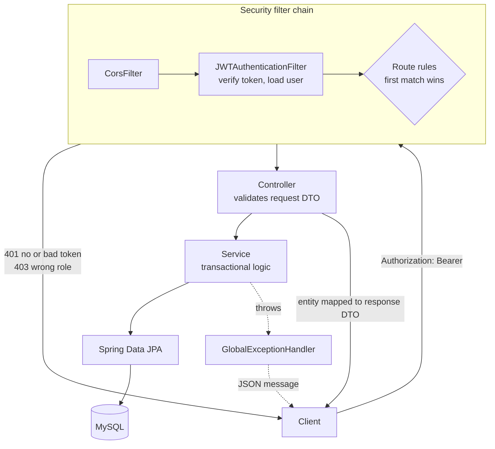

# gameStore-backend

A REST API for a game store, built with Spring Boot 3 and MySQL. It covers stateless JWT
authentication, role-based access control (`USER` / `ADMIN`), a paginated and searchable game
catalogue, admin user management, self-service profile editing, a wishlist, and a simulated checkout
with order receipts, a library, and a points ledger — with a Flyway-owned schema and an H2-backed
integration suite.

[](https://openjdk.org/projects/jdk/17/)
[](https://spring.io/projects/spring-boot)
[](https://www.mysql.com/)
[](https://flywaydb.org/)
[](LICENSE)

> **Live demo:** _coming soon_ · **Frontend:** [`Robotbino/gameStore`](https://github.com/Robotbino/gameStore) · **Docs:** [Architecture](docs/architecture.html) · [Learning guide](docs/architecture-and-learning-guide.html) · [Roadmap](docs/backend-roadmap.html)

---

## Contents

- [Quick start](#quick-start)
- [Configuration](#configuration)
- [How a request flows](#how-a-request-flows)
- [API reference](#api-reference)
  - [Auth](#auth--apiv2auth)
  - [Games](#games--games)
  - [Users](#users--users)
  - [Wishlist](#wishlist--wishlist)
  - [Orders](#orders--orders)
  - [Rewards](#rewards--rewards)
  - [Purchases (legacy)](#purchases--purchases)
- [Error contract](#error-contract)
- [Data model](#data-model)
- [Database & migrations](#database--migrations)
- [Testing](#testing)
- [Project structure](#project-structure)
- [Tech stack](#tech-stack)
- [Roadmap](#roadmap)
- [Documentation](#documentation)
- [License](#license)

---

## Quick start

### Prerequisites

| Requirement | Notes |
|---|---|
| **JDK 17** | The build targets Java 17. Newer JDKs need Lombok on an explicit `annotationProcessorPaths` entry — already configured in [`pom.xml`](pom.xml), along with a pinned Lombok `1.18.34` that avoids a Spring Data Commons 3.3 introspection crash. |
| **MySQL 8** running locally | Only the empty database has to exist; Flyway builds every table. |
| **Maven** | Optional — the `mvnw` wrapper is committed. |

### 1. Create the database

```sql
CREATE DATABASE gamestore_db;
```

That is the whole manual DB step. Flyway runs `src/main/resources/db/migration/` at startup and
creates the schema from `V1__baseline.sql` onward.

### 2. Supply the two required secrets

`application.properties` reads them as placeholders — there are no committed defaults, and the app
will not start without them:

```bash
export DB_PASSWORD='your-mysql-password'
export JWT_SECRET="$(openssl rand -base64 32)"   # Base64, >= 256 bits for HS256
```

In IntelliJ, set the same two as **environment variables** on the Run Configuration
(Run → Edit Configurations → Environment variables) rather than editing tracked files.

Alternatively, copy the committed template and activate the `local` profile:

```bash
cp src/main/resources/application-local.properties.example src/main/resources/application-local.properties
./mvnw spring-boot:run -Dspring-boot.run.profiles=local
```

`application-local.properties` is gitignored; the `.example` template is committed so a fresh clone
knows what it needs.

### 3. Run

```bash
./mvnw spring-boot:run
```

The API starts on **http://localhost:8181**.

### 4. Register, log in, call something

```bash
# Register — returns a JWT (200)
curl -X POST http://localhost:8181/api/v2/auth/register \
  -H "Content-Type: application/json" \
  -d '{"userName":"bino","email":"bino@example.com","password":"secret12"}'

# Log in — returns a JWT (200)
curl -X POST http://localhost:8181/api/v2/auth/authenticate \
  -H "Content-Type: application/json" \
  -d '{"email":"bino@example.com","password":"secret12"}'
```

Both respond with `{"access_token": "<jwt>"}`. Send it on protected routes:

```bash
curl http://localhost:8181/users/me -H "Authorization: Bearer <jwt>"
```

> Passwords must be **at least 8 characters** (Bean Validation), so a 6-character password returns
> `400` with a per-field `errors` map.

---

## Configuration

Every key lives in [`src/main/resources/application.properties`](src/main/resources/application.properties).
Only three values read from the environment today:

| Environment variable | Required | Default | Purpose |
|---|---|---|---|
| `JWT_SECRET` | **yes** | — | Base64 HMAC key for HS256 signing. Generate with `openssl rand -base64 32`; never reuse a value that has appeared in a repo or chat. |
| `DB_PASSWORD` | **yes** | — | MySQL password. |
| `DB_USERNAME` | no | `root` | MySQL user. |

Settings that are currently **hardcoded**, not environment-driven:

| Setting | Value | Where |
|---|---|---|
| Server port | `8181` | `application.properties` |
| Datasource URL | `jdbc:mysql://localhost:3306/gamestore_db` | `application.properties` |
| Admin email | `admin@gamestore.com` | `application.properties` — the account registered with this email is promoted to `ADMIN`; everyone else gets `USER` |
| JWT lifetime | `86400000` ms (24 h) | `application.properties` |
| CORS origin | `http://localhost:5173` (Vite dev server), credentials allowed | [`CorsConfig.java`](src/main/java/com/gameStore/Bino/configuration/CorsConfig.java) |
| Page size | default `20`, hard ceiling `100` | `application.properties` — the ceiling stops a client defeating pagination with `?size=100000` |
| Hibernate DDL | `validate` | Flyway owns the schema; Hibernate only checks that the entities match it, so drift fails startup instead of silently altering the database |

The commented-out entries in `application-local.properties.example` (`DB_URL`, `SERVER_PORT`,
`ADMIN_EMAIL`, `CORS_ALLOWED_ORIGINS`, `RAWG_API_KEY`) are placeholders for planned work — the
properties do not read them yet. Moving the CORS origin to an env var is roadmap **B1**.

---

## How a request flows



Three things worth knowing about that chain:

- **Sessions are stateless.** Every request re-authenticates from the `Authorization: Bearer` header;
  nothing is stored server-side.
- **Rule order in [`SecurityConfiguration`](src/main/java/com/gameStore/Bino/configuration/SecurityConfiguration.java) is load-bearing.**
  `GET /games/**` must precede the `/games/**` ADMIN rule, and `/users/me` must precede `/users/**`
  — first match wins, so the broad rule would otherwise swallow the specific one and a logged-in
  `USER` could never read their own record.
- **Identity always comes from the token**, never from a body field or query param
  (`@AuthenticationPrincipal`). Reading a user id from `?userId=` would be a textbook IDOR.

The JWT is HS256, subject = the user's **email**, with a custom `role` claim and a 24-hour expiry.

---

## API reference

Base URL `http://localhost:8181`. All request bodies are JSON and validated with `@Valid` against
dedicated request DTOs — entities are never bound directly to a request body.

### Auth — `/api/v2/auth`

| Method | Endpoint | Access | Description |
|---|---|---|---|
| POST | `/api/v2/auth/register` | Public | Create an account, returns a JWT (`200`) |
| POST | `/api/v2/auth/authenticate` | Public | Log in with email + password, returns a JWT (`200`) |

<details>
<summary><code>POST /api/v2/auth/register</code> — request and response</summary>

```json
// request
{ "userName": "bino", "email": "bino@example.com", "password": "secret12" }

// 200
{ "access_token": "eyJhbGciOiJIUzI1NiJ9..." }
```

`userName` and `email` are required, `email` must be well-formed, `password` must be ≥ 8 characters.
A duplicate email returns `400 {"message": "Email already in use"}`.
</details>

### Games — `/games`

| Method | Endpoint | Access | Description |
|---|---|---|---|
| GET | `/games/all` | Public | Paginated catalogue with optional search and genre filters |
| GET | `/games/find/{id}` | Public | One game by id |
| POST | `/games/add` | ADMIN | Create a game (`201`) |
| PUT | `/games/{id}` | ADMIN | Update a game (`200`) |
| DELETE | `/games/{id}` | ADMIN | Delete a game (`204`) |
| POST | `/games/sync/rawg` | ADMIN | **Placeholder** — returns `501 Not Implemented` pending RAWG ingestion |

**Query parameters on `/games/all`** — all optional, all combinable:

| Param | Default | Meaning |
|---|---|---|
| `q` | — | Case-insensitive substring match on title |
| `genre` | — | Exact genre match |
| `page` | `0` | Zero-based page index |
| `size` | `20` | Rows per page, clamped to `100` |
| `sort` | `id,asc` | `field,dir` — e.g. `?sort=price,desc` |

The default `id,asc` sort is deliberate: an unsorted paginated query returns rows in DB order, which
is stable within one request but not across them, so paging 2 → 3 could repeat or skip a row.

<details>
<summary><code>GET /games/all?q=witch&size=2</code> — paged envelope</summary>

```json
{
  "content": [
    {
      "id": 1,
      "title": "The Witcher 3",
      "genre": "Action,RPG",
      "price": 29.99,
      "rating": 4.9,
      "description": "…",
      "imageUrl": "https://…",
      "heroImage": "https://…"
    }
  ],
  "page": 0,
  "size": 2,
  "totalElements": 1,
  "totalPages": 1
}
```

Responses are wrapped in `PagedResponse<T>` — a small record this project owns — rather than Spring
Data's `Page<T>`, because Spring Boot 3.3 explicitly warns that `PageImpl`'s JSON shape is not a
stable contract.
</details>

> **`genre` accepts both shapes.** It is stored as a comma-separated string, but a create/update may
> send either `"Action,RPG"` or `["Action","RPG"]` — `GenreDeserializer` normalises the array form.
> `price` must be positive and fits `decimal(10,2)`; `rating` is bounded `0.0–5.0` to match RAWG's scale.

### Users — `/users`

| Method | Endpoint | Access | Description |
|---|---|---|---|
| GET | `/users/me` | Authenticated | The caller's own record, identified by the token |
| PUT | `/users/me` | Authenticated | Change your own `userName` only (`200`) — the token stays valid because its subject is the email |
| PUT | `/users/me/profile` | Authenticated | Edit your own display name, avatar, bio, region (`200`) |
| PUT | `/users/me/account` | Authenticated | Edit your own username and email (`200`, returns a fresh token) |
| PUT | `/users/me/password` | Authenticated | Change your own password, proving the current one (`204`) |
| GET | `/users/all` | ADMIN | Paginated user list (`?q=` filters by username, plus `page`/`size`/`sort`) |
| POST | `/users/add` | ADMIN | Create a user (`201`) |
| PUT | `/users/{id}` | ADMIN | Update a user (`200`) |
| DELETE | `/users/{id}` | ADMIN | Delete a user (`204`) |

Every `/users` response is mapped to `UserResponse` — `id`, `userName`, `email`, `role`, `points`,
`displayName`, `avatarKey`, `bio`, `country`, `createdAt`.
**The password hash has no field in that record**, so it cannot leak by accident; an integration test
asserts it never appears in a response body.

On `PUT /users/{id}`, `password` is optional: omit it and the stored hash is kept. `points` and `role`
are likewise only overwritten when supplied, so a partial edit can't null them out.

<details>
<summary>The three self-service endpoints — and the two traps they exist to avoid</summary>

They are split three ways rather than folded into one endpoint so each maps to exactly one form
on the settings page, and a bug in one can't reach the others. (The older `PUT /users/me`, which takes
`UpdateProfileRequest{userName}`, remains as a username-only shortcut; `/account` supersedes it for
anything that touches the email.) **None of them accepts `role`, `points`,
or `enabled`** — a caller editing themselves has no field to put a promotion in, the same trick
`UserResponse` plays with the password hash.

```json
// PUT /users/me/profile — every field REPLACES, including with null, so a bio can be cleared
{ "displayName": "Bino H", "avatarKey": "marquee-09", "bio": "Mostly RPGs.", "country": "ZA" }

// PUT /users/me/account — 200
{ "user": { "id": 14, "userName": "DemoUser", "…": "…" }, "access_token": "eyJhbGciOiJIUzI1NiJ9..." }

// PUT /users/me/password — 204 on success
{ "currentPassword": "…", "newPassword": "…" }
```

**Why `/account` hands back a token.** A JWT's subject is the user's *email*, and `JWTAuthenticationFilter`
resolves the caller by `findByEmail` on that subject. The instant someone changes their email, every
token they hold names an address that no longer exists — the filter finds nobody, the request arrives
unauthenticated, and the frontend's 401 interceptor throws them at the login page mid-save. The
response carries a re-minted token so the client can swap it in and stay signed in.

**Why a wrong current password is `400`, not `401`.** 401 is the honest status and the wrong choice
here: the frontend treats any 401 outside `/auth/*` as a dead session and clears the token. A typo in
the "current password" box would log you out. `InvalidPasswordException` maps to 400 instead — the same
reasoning that already made duplicates 400 rather than 409.

Note the security chain matches `"/users/me"` **and** `"/users/me/**"`. The first pattern alone matches
only that exact path, so every sub-path would fall through to the `/users/**` ADMIN rule and 403 for
the users it exists to serve. `ProfileEndpointsIT` asserts a plain USER reaches all three.
</details>

### Wishlist — `/wishlist`

| Method | Endpoint | Access | Description |
|---|---|---|---|
| GET | `/wishlist/me` | Authenticated | The caller's wishlist, most recently added first (`200`) |
| POST | `/wishlist/{gameId}` | Authenticated | Save a game for later (`201`); adding it twice returns the existing entry |
| DELETE | `/wishlist/{gameId}` | Authenticated | Remove a game (`204`); removing one that isn't there is also `204` |

`/wishlist` has no rule of its own in `SecurityConfiguration` — it falls through to
`anyRequest().authenticated()`, and the list is scoped in `WishlistService` from the token's subject.

<details>
<summary><code>GET /wishlist/me</code> — response</summary>

```json
// 200
[
  { "id": 3, "addedAt": "2026-09-20T09:12:44.118", "game": { "id": 1, "title": "The Witcher 3", "…": "…" } }
]
```

Each row is a `WishlistResponse(id, addedAt, game)`. The `wishlist` table (V4) carries a unique key on
`(user_id, game_id)`, so a repeat `POST` cannot create a second row even if the service check were
bypassed; `WishlistIT` asserts the second add leaves one entry. An unknown `gameId` returns `404`.
</details>

### Orders — `/orders`

| Method | Endpoint | Access | Description |
|---|---|---|---|
| POST | `/orders/checkout` | Authenticated | Simulated checkout: creates an order, snapshots the lines, moves points, grants ownership (`201`) |
| GET | `/orders/me` | Authenticated | The caller's receipts, newest first (`200`) |
| GET | `/orders/{id}` | Authenticated | One receipt — scoped to the caller, so someone else's id is `404` (`200`) |

`/orders/**` and `/rewards/**` have an explicit `.authenticated()` rule. **This is the checkout.**
`POST /purchases` below is the older path from B9 and still works, but it writes no order, moves no
points, and is kept only so existing clients don't break.

<details>
<summary><code>POST /orders/checkout</code> — request and receipt</summary>

```json
// request — the buyer is never in the body; it comes from the JWT
{ "gameIds": [1, 2, 2], "paymentMethod": "CARD", "redeemPoints": true }

// 201
{
  "id": 7,
  "subtotal": 29.99,
  "pointsRedeemed": 500,
  "discount": 5.00,
  "total": 24.99,
  "pointsEarned": 249,
  "pointsBalance": 249,
  "paymentMethod": "CARD",
  "paymentReference": "DEMO-K7Q2XN",
  "status": "PAID",
  "createdAt": "2026-09-20T09:14:02.551",
  "items": [
    { "gameId": 1, "title": "The Witcher 3", "unitPrice": 29.99, "imageUrl": "https://…" }
  ],
  "alreadyOwned": [2]
}
```

`gameIds` is `@NotEmpty`, `paymentMethod` is `@NotNull` and one of `CARD | STRIPE | PAYFLEX`
(`PaymentMethod` enum — an unknown value is a `400 {"message": "Malformed request body"}`), and
`redeemPoints` defaults to `false`.

What happens inside the one transaction in `OrderService.checkout`:

1. Ids are de-duplicated; each must exist (`404` otherwise). Games the caller already owns go to
   `alreadyOwned` and are excluded from the totals. If nothing is left to pay for, the request is
   `400 {"message": "Nothing to pay for: you already own every game in this cart"}` and no points move.
2. `subtotal` is the sum of the payable prices. With `redeemPoints`, the discount is the whole balance's
   Rand value, **capped at the subtotal**; `total = subtotal − discount`.
3. An `orders` row is written with an `order_items` line per game that **snapshots `title` and
   `unitPrice`** at that moment — a later price edit or catalogue delete never rewrites a receipt
   (`order_items.game_id` is `ON DELETE SET NULL`, and `gameId`/`imageUrl` come back `null` in that case).
4. `paymentReference` is `DEMO-` plus six characters from `SecureRandom`; the column is `UNIQUE`.
   `status` is always `PAID` — there is no payment provider and the server never declines.
5. A `REDEEM` and/or `EARN` row lands in `reward_transactions` and `users.points` is updated (see Rewards).
6. A `purchases` row is written per game, so `GET /purchases/me` and the library show the same ownership
   whether a game was bought through the new or the legacy path.

`pointsBalance` is the balance **after** this order. `alreadyOwned` is always `[]` on the two `GET`s.
`CheckoutIT` covers earning, redeeming, the cap, the zero-balance no-op, the all-owned `400`, owner
scoping on `GET /orders/{id}`, the unknown-game `404` and the bad-enum `400`.
</details>

### Rewards — `/rewards`

| Method | Endpoint | Access | Description |
|---|---|---|---|
| GET | `/rewards/me` | Authenticated | Points balance, its Rand value, and the last 20 ledger rows (`200`) |

<details>
<summary><code>GET /rewards/me</code> — response and the two constants</summary>

```json
// 200
{
  "balance": 249,
  "worth": 2.49,
  "transactions": [
    { "id": 12, "delta": 249,  "balanceAfter": 249, "reason": "EARN",   "orderId": 7, "createdAt": "2026-09-20T09:14:02.560" },
    { "id": 11, "delta": -500, "balanceAfter": 0,   "reason": "REDEEM", "orderId": 7, "createdAt": "2026-09-20T09:14:02.557" }
  ]
}
```

[`RewardsService`](src/main/java/com/gameStore/Bino/service/RewardsService.java) is the single source of
truth for the maths, in two constants:

| Constant | Value | Rule |
|---|---|---|
| `POINTS_PER_RAND_EARNED` | `10` | Earn 10 points per R1 of the order's **final** total (after any discount), rounded down |
| `POINTS_PER_RAND_OFF` | `100` | Redeem 100 points = R1 off at checkout, capped at the subtotal; `worth` is the balance at this rate |

`reason` is `EARN`, `REDEEM` or `ADJUST`. `orderId` is `null` if the order has since been deleted
(`ON DELETE SET NULL`). `users.points` is the denormalised balance and is written in the same
transaction as every ledger row, so `balanceAfter` doubles as an audit trail. The frontend mirrors the
two rules for previews, but the server always recomputes.
</details>

### Purchases — `/purchases`

> **Legacy path.** These predate `/orders` (roadmap B9). `POST /purchases` grants ownership but writes
> no receipt and touches no points; new clients should call `POST /orders/checkout`, which writes the
> same `purchases` rows. `GET /purchases/me` remains the library read.

| Method | Endpoint | Access | Description |
|---|---|---|---|
| POST | `/purchases` | Authenticated | Buy one or more games for the caller, no receipt or points (`201`) |
| GET | `/purchases/me` | Authenticated | The caller's library, most recent first (`200`) |

<details>
<summary><code>POST /purchases</code> — legacy checkout</summary>

```json
// request — the buyer is never in the body; it comes from the JWT
{ "gameIds": [1, 2, 2] }

// 201
{
  "purchased": [
    { "id": 10, "purchaseDate": "2026-08-08T14:03:11.482", "game": { "id": 1, "title": "…" } }
  ],
  "alreadyOwned": [2]
}
```

The cart posts its whole contents in **one** request, so one checkout is one transaction rather than
N sequential calls that could half-fail. Ids are de-duplicated, and re-buying an owned game is
**reported in `alreadyOwned`, not thrown** — so the full login → cart → checkout → library flow can be
run twice (a rehearsal, then a live demo) without the second run erroring out. An unknown game id
returns `404`.
</details>

---

## Error contract

Every error is JSON shaped `{"message": "..."}`, produced by
[`GlobalExceptionHandler`](src/main/java/com/gameStore/Bino/exceptions/GlobalExceptionHandler.java).

| Status | When | Body |
|---|---|---|
| `400` | Bean Validation failure | `{"message": "Validation failed", "errors": {"password": "password must be at least 8 characters"}}` |
| `400` | Duplicate email or username | `{"message": "Email already in use"}` |
| `400` | Wrong current password on `PUT /users/me/password` | `{"message": "Current password is incorrect"}` — `400`, not `401`, so the frontend doesn't treat a typo as a dead session |
| `400` | A cart with nothing left to pay for | `{"message": "Nothing to pay for: you already own every game in this cart"}` (`InvalidCheckoutException`) |
| `400` | Body Jackson can't bind (malformed JSON, unknown `paymentMethod`) | `{"message": "Malformed request body"}` |
| `401` | Missing, expired, or invalid token | empty body — `HttpStatusEntryPoint` returns 401 (not 403) so the frontend can redirect to login |
| `401` | Wrong password or unknown user | `{"message": "Invalid email or password"}` — deliberately vague, so it can't be used to enumerate accounts |
| `403` | Valid token, insufficient role | Spring Security default |
| `404` | Missing record | `{"message": "Game not found with id: 42"}` |
| `404` | No such route | `{"message": "No such endpoint"}` — `NoResourceFoundException` is mapped explicitly, so a client built against a newer API than the running server sees a 404, not a server fault |
| `500` | Anything else unmapped | `{"message": "An unexpected error occurred"}` — the real cause is logged, never returned |

That `500` backstop matters: an earlier version mapped `RuntimeException` to `400`, which blamed the
client for genuine server bugs (an NPE surfaced as "Bad Request"). Until 2026-09-20 the reverse mistake
also existed — an unmapped path fell into the same backstop and reported itself as a `500`. One caveat
on the new `404`: the security chain runs first, so an **anonymous** request to a path that doesn't
exist still gets the `401` from `anyRequest().authenticated()`; the `404` is what an authenticated
caller sees.

Duplicates return `400` rather than the more textbook `409` because the frontend's error catalogue
keys on `400` for that case — documented in §8 of the architecture doc.

---

## Data model


Three tables share the user–game axis and mean three different things. `purchases` is **ownership** —
the library reads it, and both checkout paths write it. `wishlist` is **intent**, with a unique
`(user_id, game_id)` so a game is saved once. `orders` is the **receipt**: totals, the payment method
chosen, and a `DEMO-` reference, with an `order_items` line per game that snapshots `title` and
`unit_price` at the moment of purchase so a later price change never rewrites history. That is also
why `order_items.game_id` is nullable and `SET NULL` on delete: the line outlives the catalogue row.

`points` is a **simulated rewards balance**, settled on 2026-09-20 and implemented in
[`RewardsService`](src/main/java/com/gameStore/Bino/service/RewardsService.java): you earn 10 points per
R1 of an order's **final** total (after any discount, rounded down) and can redeem 100 points for R1 off
at checkout, capped at the subtotal. `reward_transactions` is the ledger — one row per movement with
`delta`, `balance_after`, a `reason` and the order that caused it — and `users.points` is the
denormalised balance written in the same transaction, readable at `GET /rewards/me`. The points have
no cash value: the whole economy is simulated, no payment provider exists or is planned, and every
order is `PAID` the instant it is placed.

`Users` implements Spring Security's `UserDetails`, and `getUsername()` returns the **email** —
authentication is by email, while `getUserName()` remains the display name. Both `Purchases`
associations are `LAZY` and both back-references are `@JsonIgnore`, which is why every endpoint
returns a response DTO rather than an entity: serializing one directly would either fire N+1 queries
or throw `LazyInitializationException` outside a transaction.

`users.id` is `int` while `games.id` is `bigint` — accepted debt from the pre-Flyway era, recorded in
the V1 baseline rather than quietly fixed, since changing a referenced PK type carries real risk for
no user-visible benefit.

The profile fields added in V6 sit **flat on `users`** rather than in a 1:1 `user_profiles` table. At
four columns the split would buy a join and a lifecycle question — create the row at registration, or
lazily on first save? — and would put a box on this diagram that carries no relationship information.
Worth revisiting if preferences ever outgrow a single row; not before.

`display_name` and `user_name` are both names on purpose. `user_name` carries the `UNIQUE` key and is
the identity the account is looked up by; `display_name` is a free label with no constraint, so
renaming yourself can never collide with somebody else's handle. The UI prefers the label and falls
back to the handle.

---

## Database & migrations

Flyway owns the schema. Migrations live in `src/main/resources/db/migration/` and run at startup.

| Migration | What it does |
|---|---|
| `V1__baseline.sql` | The schema exactly as `ddl-auto=update` left it, quirks preserved, so `validate` passes unchanged |
| `V2__dedupe_games_and_standardise_art.sql` | Removes duplicate catalogue rows and normalises artwork URLs |
| `V3__games_price_precision.sql` | Narrows `games.price` from Hibernate's default `decimal(38,2)` to `decimal(10,2)` |
| `V4__wishlist.sql` | Creates `wishlist` with a unique `(user_id, game_id)` key; rows cascade away with their user or game |
| `V5__orders_rewards.sql` | Creates `orders`, `order_items` (title/price snapshots, `game_id` `SET NULL` on delete) and `reward_transactions` (the points ledger); backfills `users.points` from `NULL` to `0` so arithmetic starts at zero |
| `V6__user_profile_fields.sql` | Adds `display_name`, `avatar_key`, `bio`, `country`, `created_at` to `users`, backfilling `created_at` from each account's first purchase |

`spring.flyway.baseline-on-migrate=true` stamps a pre-existing database at V1 without re-running the
baseline against it; a fresh environment with an empty schema **does** run V1 and builds the tables
from zero. Because `ddl-auto` is `validate`, any entity that drifts from the migrated schema fails
startup loudly instead of silently altering the database — which is why `@Column(precision = 10, scale = 2)`
landed on `Games.price` in the same commit as V3.

---

## Testing

```bash
./mvnw test     # unit tests only (Surefire, *Tests)
./mvnw verify   # unit + integration tests (Failsafe, *IT)
```

Integration tests run against an in-memory **H2** database configured in
`src/test/resources/application.properties`, so the suite needs no MySQL, no real secrets, and can
never touch your dev data. Flyway is disabled under test — `V1__baseline.sql` is MySQL-specific
(`bit(1)`, `ENGINE=InnoDB`) and would fail or, worse, half-succeed against H2 — so Hibernate rebuilds
the schema per run with `create-drop`.

| Suite | Covers |
|---|---|
| [`AuthFlowIT`](src/test/java/com/gameStore/Bino/AuthFlowIT.java) | Register, duplicate email, field-level validation errors, login success, and the vague-message 401 on a wrong password |
| [`GamesEndpointsIT`](src/test/java/com/gameStore/Bino/GamesEndpointsIT.java) | Anonymous read access, the paged envelope, `?q=` / `?genre=` filtering, page/size behaviour, ADMIN-vs-USER `403`, validation bounds, and both `genre` input shapes |
| [`UsersEndpointsIT`](src/test/java/com/gameStore/Bino/UsersEndpointsIT.java) | The full RBAC ladder (`401` anonymous → `403` user → `200` admin), `/users/me` self-service, and the guarantee that no response ever contains a password |
| [`SelfServiceUserIT`](src/test/java/com/gameStore/Bino/SelfServiceUserIT.java) | `PUT /users/me` (username only, taken name → `400`, blank → field error, anonymous → `401`) and `PUT /users/me/password` (new password works and the old one stops, wrong current → `400` not a logout, short new password → field error) |
| [`ProfileEndpointsIT`](src/test/java/com/gameStore/Bino/ProfileEndpointsIT.java) | The three `/users/me/**` endpoints: that a plain USER reaches them at all, that nulls clear a field, that a caller can't promote themselves, the uniqueness guard excluding your own row, the replacement token on an email change, and the `400`-not-`401` on a wrong current password |
| [`WishlistIT`](src/test/java/com/gameStore/Bino/WishlistIT.java) | Anonymous `401`, add-then-list, a second add keeping one entry, unknown game `404`, remove-then-list empty with a repeat `DELETE` still `204`, and that the list is scoped to the caller |
| [`CheckoutIT`](src/test/java/com/gameStore/Bino/CheckoutIT.java) | `POST /orders/checkout`: snapshots and points earned, redemption reducing the total and deducting points, the cap at the subtotal, the zero-balance no-op, `alreadyOwned` excluded from totals, the all-owned `400` moving no points, owner scoping on `GET /orders/{id}`, unknown game `404`, bad `paymentMethod` `400` |

---

## Project structure

```
src/main/java/com/gameStore/Bino/
├── authentication/     # Register/login request & response DTOs
├── configuration/      # Security filter chain, JWT filter, CORS, app beans
├── controllers/        # Auth, Games, Users, Purchase, Wishlist, Order, and Rewards REST controllers
├── dto/                # Request/response DTOs — GameResponse, UserResponse, PagedResponse,
│                       #   UpdateProfileRequest / UpdateProfileDetailsRequest / UpdateAccountRequest /
│                       #   ChangePasswordRequest / AccountUpdateResponse, WishlistResponse,
│                       #   CheckoutRequest / OrderResponse / OrderItemResponse,
│                       #   RewardsSummaryResponse / RewardTransactionResponse, …
├── exceptions/         # GlobalExceptionHandler + ResourceNotFound, Duplicate, InvalidPassword, InvalidCheckout
├── models/             # Users, Games, Purchases, Wishlists, Orders, OrderItems, RewardTransactions entities;
│                       #   Role, PaymentMethod, OrderStatus, RewardReason enums; GenreDeserializer
├── repositories/       # Spring Data JPA repositories, one per entity
└── service/            # Auth, JWT, Games, Users, Purchase, Wishlist, Order, and Rewards business logic

src/main/resources/
├── application.properties                    # All config; secrets read from the environment
├── application-local.properties.example      # Committed template for local secrets
└── db/migration/                             # Flyway migrations (V1 → V6)
```

Layering is conventional and enforced by habit rather than tooling: controllers map DTOs and delegate,
services hold the transactional logic and own every business rule, repositories touch the database.
Entities never cross the controller boundary in either direction.

---

## Tech stack

| Layer | Choice |
|---|---|
| Language | Java 17 |
| Framework | Spring Boot 3.3.4 — Web, Data JPA, Security, Validation |
| Persistence | MySQL 8 + Hibernate, schema owned by Flyway, `ddl-auto=validate` |
| Auth | JWT (jjwt 0.11.5, HS256), stateless, BCrypt-hashed passwords |
| Boilerplate | Lombok 1.18.34 (pinned) |
| Build | Maven, Surefire + Failsafe |
| Test | JUnit 5, Spring Security Test, H2 |

---

## Roadmap

Tracked in full — with rationale and verdicts — in [`docs/backend-roadmap.html`](docs/backend-roadmap.html).

**Done**

- [x] Role-based restrictions on games and users endpoints (ADMIN-only management)
- [x] Self-service `GET /users/me` returning a `UserResponse` DTO
- [x] Proper error responses (JSON `{"message": …}` with correct status codes)
- [x] Bean Validation on request payloads (`@Valid` DTOs, field-level `errors` on 400)
- [x] H2 integration tests for auth, RBAC, the DTO contract, and validation
- [x] **B7** — Flyway wired up, `ddl-auto` moved to `validate`
- [x] **B8** — `games.price` narrowed to `decimal(10,2)`
- [x] **B9** — Purchase and library endpoints
- [x] **B10** — Server-side search, sort, and pagination
- [x] **B11** — `GameResponse` DTO
- [x] **B17** — Cart, checkout, and order snapshots (2026-09-20) — `POST /orders/checkout`, `orders` + `order_items`, `DEMO-` references

**Landed off the roadmap (2026-09-20)**

Built the same day as B17, outside the planned order, without a card of their own:

- [x] Wishlist — `GET /wishlist/me`, `POST` / `DELETE /wishlist/{gameId}`, V4
- [x] Rewards ledger and redemption — `reward_transactions`, `GET /rewards/me`, 10 pts per R1 earned, 100 pts = R1 off at checkout
- [x] Self-service profile, account and password endpoints — `PUT /users/me`, `/users/me/profile`, `/users/me/account` (re-minted token), `/users/me/password`, V6
- [x] `404 {"message": "No such endpoint"}` for unmapped routes instead of a generic `500`

**Next**

- [ ] **B1** — Read the CORS origin from an env var
- [ ] **B2** — Add a production Spring profile
- [ ] **B3** — Fix the startup log that lies about the admin account
- [ ] **B4/B5** — Dockerise, then deploy to an Oracle Cloud Always-Free ARM VM
- [ ] **B6** — Publish the two backend briefs to GitHub Pages
- [ ] **B12** — Actuator, exposing only `/health`
- [ ] **B13** — CI on every push (`mvnw verify`)
- [ ] **B14** — Unit tests for the pure logic (`RewardsService`'s two rules are the obvious first target)
- [ ] **B15** — Document `POST /games/sync/rawg`
- [ ] **B16** — RAWG catalogue with a tiered read-through cache
- [ ] **B18** — Rate-limit the auth endpoints
- [ ] **B19** — Refresh-token rotation

---

## Documentation

An interactive engineering handbook ships in `docs/` — open the HTML files in any browser, no build
step required.

| Doc | What it covers |
|---|---|
| [`docs/architecture.html`](docs/architecture.html) | Backend architecture, request lifecycle, and security, plus the caching strategy, persistence plan, $0 deployment, Docker topology, hardening, and scorecard (§11–§16) |
| [`docs/architecture-and-learning-guide.html`](docs/architecture-and-learning-guide.html) | Design patterns, Spring internals, and an OCA-badged Java tour with quizzes |
| [`docs/backend-roadmap.html`](docs/backend-roadmap.html) | Every roadmap item with its rationale, verdict, and maturity ladder |
| [Frontend architecture](https://github.com/Robotbino/gameStore) | The companion React app, its roadmap board, and the recruiter checklist |

The two repos' docs cross-link via a switcher strip at the top of each page.

---

## License

[MIT](LICENSE) © Bino Hlongwana
